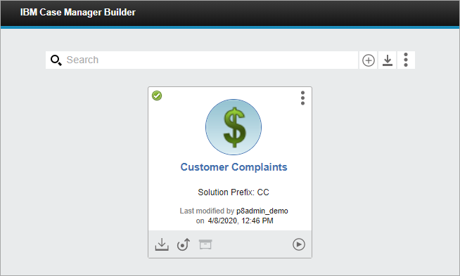
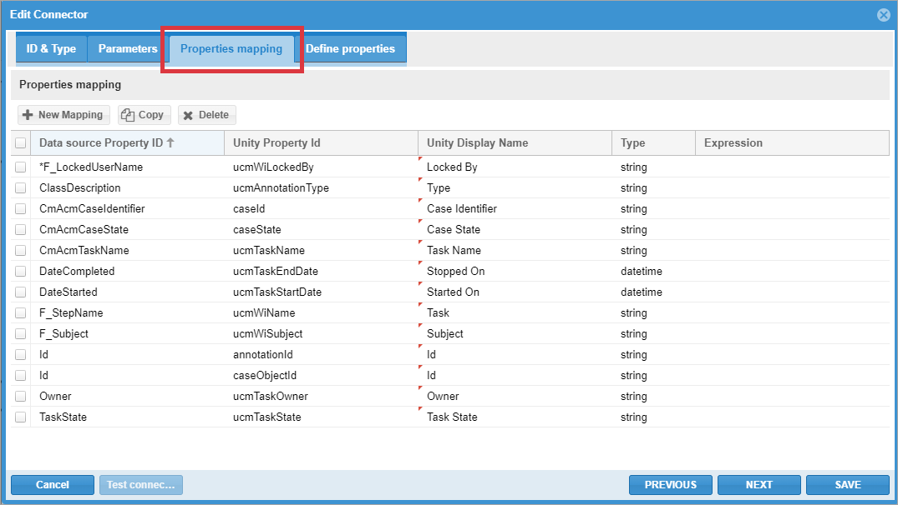
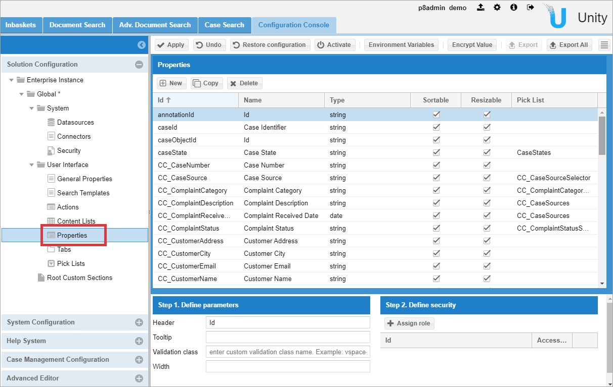
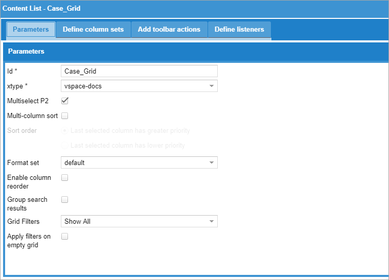
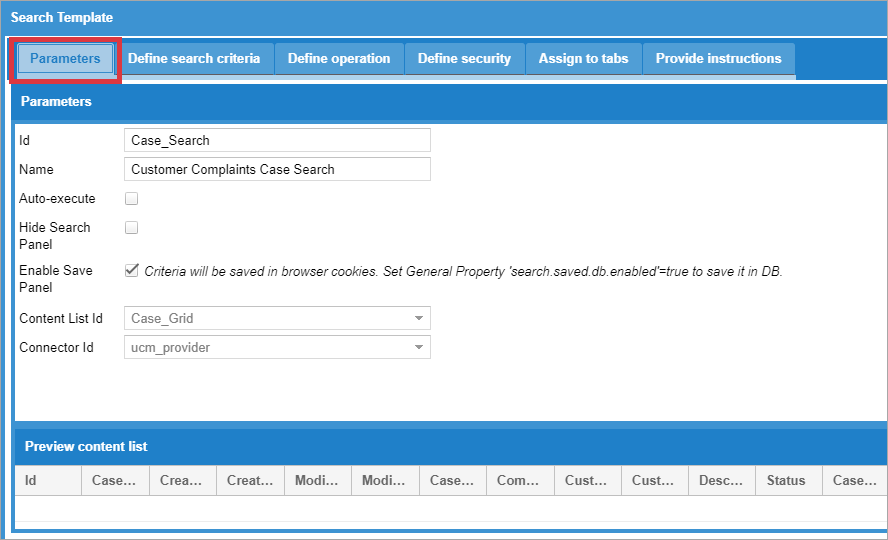

This course gives an overview of how to configure Unity Case Management solution using Configuration Console in Unity ExtJS platform.

# IBM Case Manager (ICM)

IBM Case Manager (ICM) provides a platform that seamlessly integrates capabilities from across IBM Software Group to deliver the advanced requirements needed to drive better case outcomes.   
The platform combines enterprise content management and business process management, along with integrated rules, events, collaboration, and analytics to deliver a comprehensive case management product. 
On top of this platform, IBM Case Manager provides a set of tooling that enables business analysts to quickly define solutions and then to collaborate with customers and IT to deliver them.

## ICM object model

### Solution

A Solution is a set of related business problems (or Case Types).

 

### Properties

Properties are used to store details of the case and documents.

### Case Types

Case Types define the Tasks, the necessary document types to support the Task, the task steps, and the Roles that must complete those steps to solve a business problem. 
The Case Type also includes Properties that are displayed to case workers in Views. Related Case Types make up a Solution.

### Tasks

A Task represents a specific activity that is performed as part of a case. The Task consists of one or more steps that must be completed to complete the Task.
Generally, a case is not complete until all required Tasks are completed or manually disabled, or any running Task is completed or canceled.
Tasks can be started when case is created, based on case field property change or can be launched manually. Active Task will have one or more work items created.

### Document Types

Document Types group similar documents and the information about the documents that are related to the case. 

### Roles

Users and groups are assigned to Roles in the Case Manager Client to specify which users can access a particular Task or step.

### In-baskets

A personal In-basket holds steps that need to be done by a specific case worker to complete case Tasks. A role In-basket holds steps that are assigned to a Role. In Case Manager Client, steps are called work items.

### Unity Case Management (UCM) & ICM

Unity works with deployed ICM solution and allows to configure UI to work with cases and tasks

- Cases
    - Case search allows to search for cases based on provided search criteria
    - Case view is displayed when case is opened from case view and allows to work with case properties, attachments (documents), tasks, history & comments
    
- Tasks
    - Inbaskets display work items available for the selected Role for corresponding task type 
    - Inbaskets provide filters to narrow down search and actions (workflow responses) to process task
    - When work item is opened from the Inbasket, Work Item view is displayed
    - Normally work item view displays case/task properties, it can also display documents attached to case, comments & history of the case

# Unity Case Management (UCM) Configuration

UCM configuration is stored in separate file and should be linked to main configuration file. It is done in XML and can be configured using Advanced Editor in Configuration Console.  
Template configuration uses Environment Variables, so when name and location of UCM configuration file is provided, it is automatically applied.

## Common configuration steps

## Environment Variables

Environment variables are externalized in separate file. It allows to promote application to different environments without changing configuration.  
Make sure to point to the folder UCM solution file is saved in as well as provide name:

## Connectors

Connector Type should be `UCM` for Case Management:

### Properties mapping

Unity allows to create application-level consolidated model (Properties). External repositories data models can be mapped into application model allowing users to have unified view of documents and/or cases.

Set of required property mappings required for UCM:

### Custom Properties

This property must be defined for UCM:

## Properties

Define Properties:

## Pick Lists

Define Pick Lists:

## Access Roles

Access Roles allow users and groups to access search templates based on the grant or deny rights assigned.  
Access Roles can be assigned to search templates or tabs.

# Case Search and Case View Configuration

Configuration steps:

## Content List

### Parameters

Define Content List parameters:

### Column Sets

Define Column Sets:

### Actions

Create Actions for each case type:

### Listeners

Define UCM Listeners required:

## Search Template

### Search Template Parameters

Define Search Template parameters:

## Field Sets
## Case View
