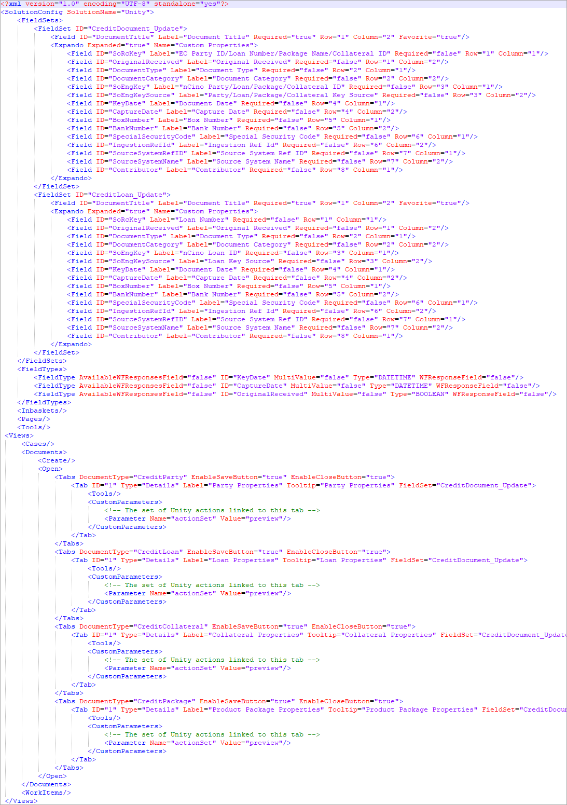
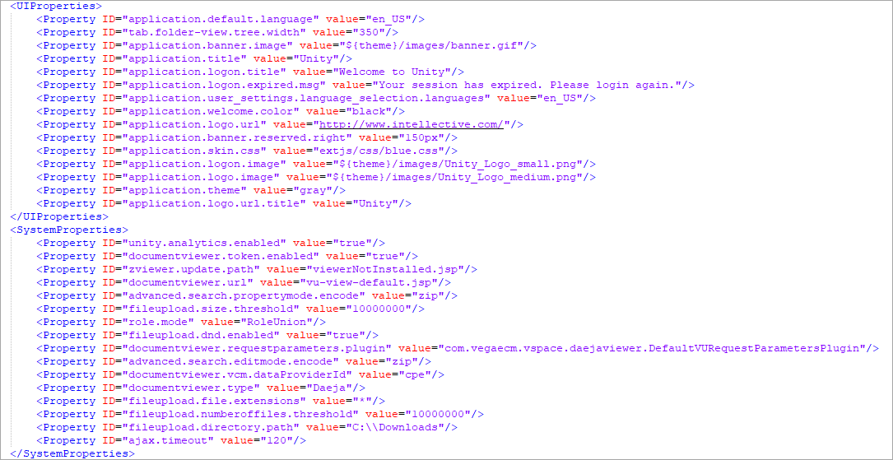
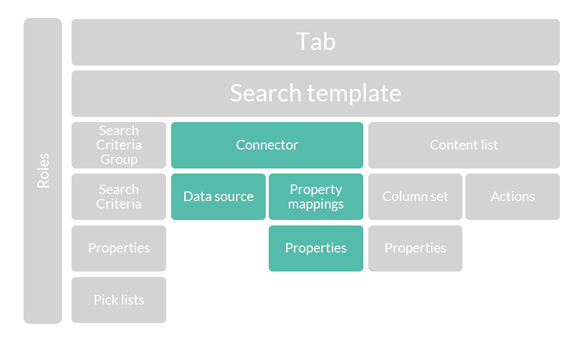
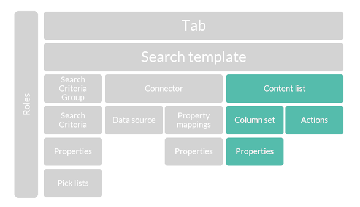
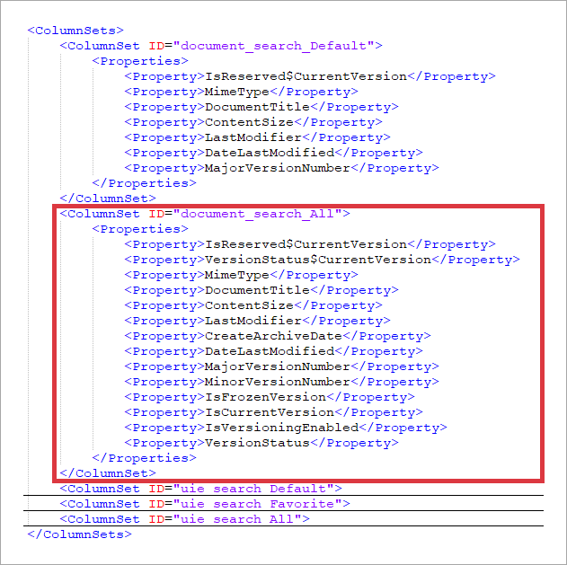
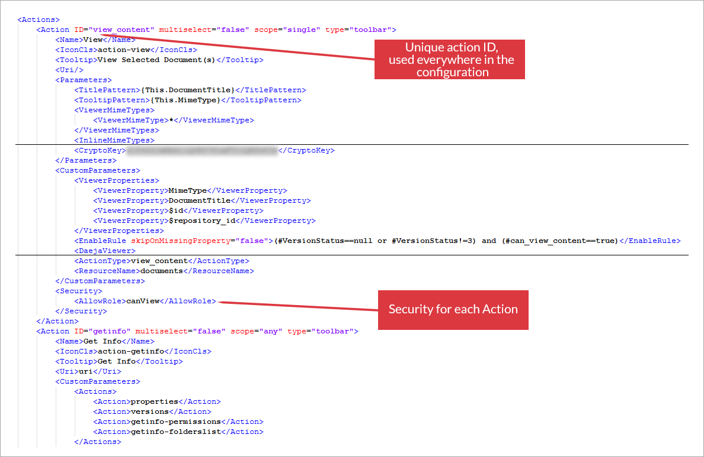
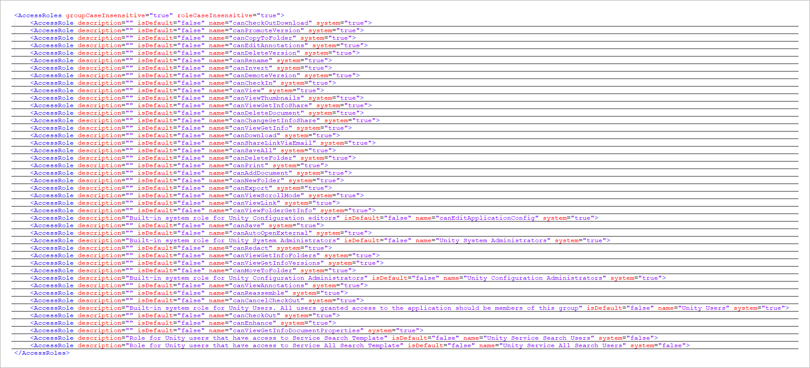
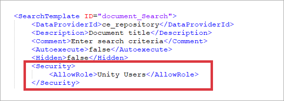
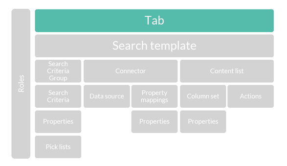
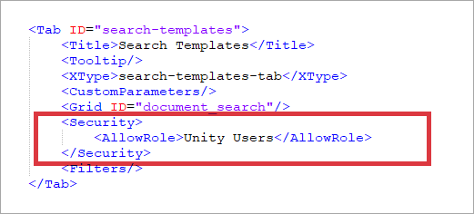

This course gives an overview of Unity React UI configuration for document management.

# Unity Configuration File

Unity stores all configuration information for the application in an XML configuration file.  
Location of configuration file is specified in Environment Variables configured for application server.

By default, the file is stored to a server drive location of the Web Application Server. 
Default name is `unity_config.xml`.

Unity configuration file is also associated with a Solution file which stores information about the detail views of a document, case or a work item.

Solution file and Solution name defined in Unity configuration file:

Solution configuration file:

General Properties in Unity configuration file:

Perspective in Unity configuration file:

Document Management configuration includes the following UI elements: 

# Use Case

Use Case: Connect to a document repository, configure Search Template, Content List to display results, and assign it to a Tab.  
Steps required: 

## Environment Variables

Environment variables are externalized in separate file (e.g. `unity_config-environment.ini`):

It provides the ability to promote application to different environments without changing configuration.

## Connectors

Connectors allow Unity, Enterprise Search and Interchange to read, write and search for the purpose of basic CRUD operations and crawling for data migration and index creation. 

### Datasources configuration

Datasource is the configuration of the authentication and access parameters that allow connection to the repository:

### Connectors configuration

Connector is the configuration of the "view" of the information (properties, metadata, objects, etc.) from the datasource that will be used by Unity for actions.

Each Connector has `ID` for further linking, Connector Type, linked `Datasource`, max number of returned results `result_limit` and other parameters:  

#### Properties mapping

Unity allows for the creation of an application-level consolidated model (properties). External repositories data models can be mapped into the application model allowing users to have unified view of documents and/or cases.

Each Connector Property should be mapped to Unity Property:

#### Properties configuration

Properties configuration in Unity configuration file:

#### Pick Lists configuration

Pick Lists, also called `Selectors` are predefined selection lists that are used in association with `Properties` to assist in limiting values to a property to a specific and limited set of choices.

Pick Lists:
- can also be used to translate a stored code or numeric value into a UI friendly value to display in a Content List, Search Criteria or other Unity Construct
- are required for List Filters in a Content List column
- can be a Static list created in Unity or a cached or non-cached list retrieved from a connected data source

## Content List Configuration

The Content List (Grid) is used by Search Templates , Actions and Tabs to present search results to a user.

Unity provides following configuration features for Content List :

- Define column set for the Grid
- Enable/disable column re-order
- Enable/disable multi-column sort and set sort order
- Configure toolbar Actions
- Configure listeners for grid events
- Configure Filters for Search results

Define Column Set properties:

Define Actions:

## Access Roles Configuration

Access Roles allow users and groups to access search templates based on the grant or deny rights assigned.
Access Roles can be assigned to search templates or tabs.

Set access roles parameters (role name, description etc):

You can add or remove users or groups, set `Grant` or `Deny` rights to users or groups:

## Search Template Configuration

Search template configuration provides the capability to pre-configure and save: 
- selected repository Connector
- search criteria
- search results Grid (Content List) configuration 

Access to Search Templates is controlled by [Access Roles](#access-roles-configuration).  
Search Template should be assigned to the Tab to be available to Unity users.

Define Search Criteria:

Additional parameters for each criterion can be defined along with associating a pick list or a default value using macros.

You can combine criteria in groups: which are then displayed grouped in UI:

Assign Roles to Search Template:

## Tab Configuration

`TemplateSet` configuration is used to assign the search templates for the tab:

`TemplateSet ID` should match the ID of the tab and end with “-templates-set”

Assign Roles to the Tab:

# Test Configuration

Sample Test URL: `http://localhost:9080/vu/analytics`

Select a Search Template from a dropdown list, execute search and check how search results are displayed in content list.

