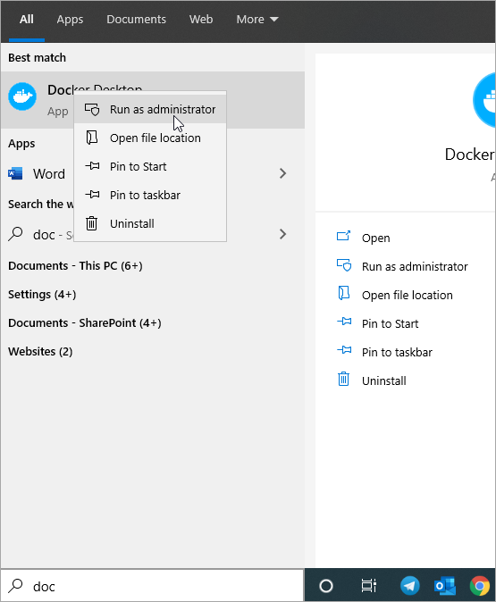
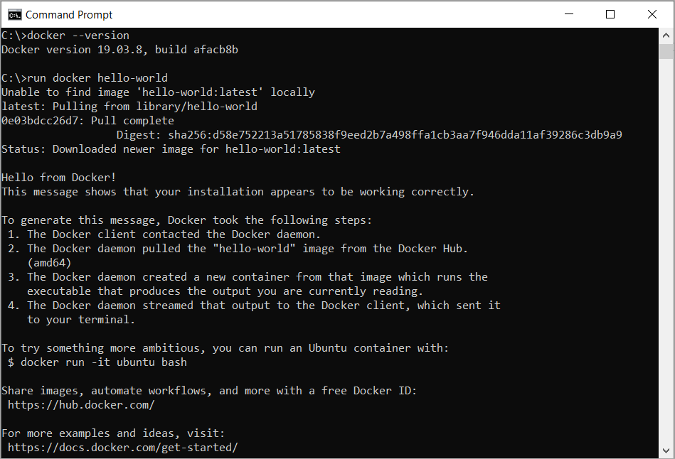
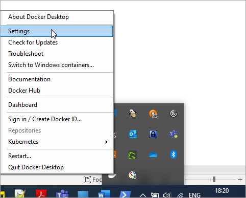
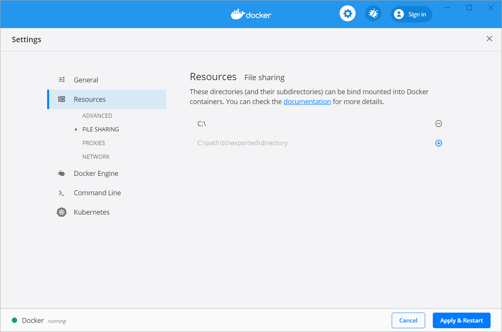
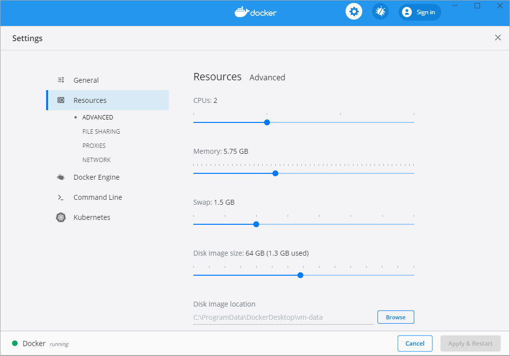

# Docker Installation 

- Check if the Virtualization is enabled on your laptop: 

	 
	
	If Virtualization is disabled, [enable](https://mashtips.com/enable-virtualization-windows-10/) it.  

- [Download](https://hub.docker.com/editions/community/docker-ce-desktop-windows/) and install Docker 
- Run Docker as administrator if logged user is not a local admin: 
	
	 

- Open Command Prompt or PowerShell in admin mode 
- Run `docker --version` or `docker run hello-world` to ensure you have a supported version of Docker: 
	
	 

- After Docker desktop is installed, share the drive where you would place configuration files. 
	
	Open the Docker Desktop menu by clicking the Docker icon in the notifications area and select Settings: 
	
	 
	
	Go to `Resources > File sharing`, select `C` drive and click `Apply&Restart` button: 
	
	 
	
	Also you can verify and adjust Advanced settings accordingly: 
	
	 
	
So Docker is installed correctly and ready to use. 
For additional information refer to [Docker for Windows](https://docs.docker.com/docker-for-windows/). 
	
# Troubleshooting 

- When starting the Docker Desktop, got the error message saying user is not a part of a local group `docker-users`. 
	
	**Solution** 
	
	Add user to local group `docker-users` in terminal window:  

	`net localgroup docker-users AzureAD\user@intellective.com /add` 

	where `user@intellective.com` is your username. 
