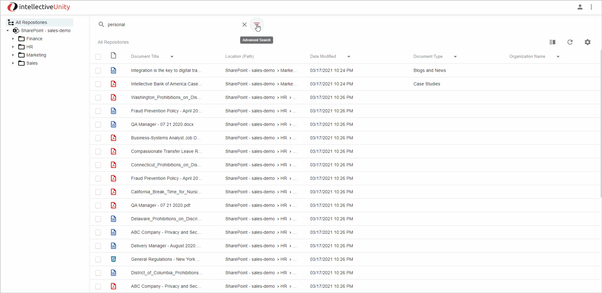
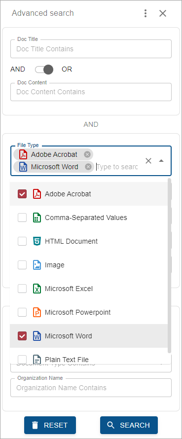
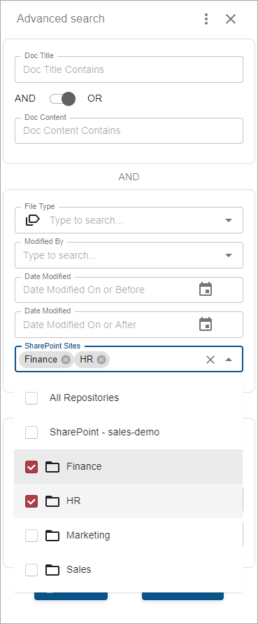
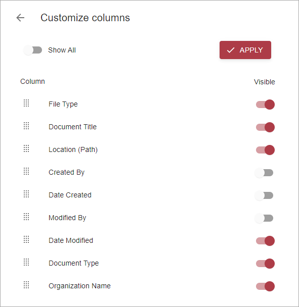
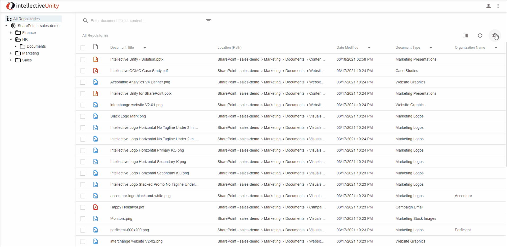
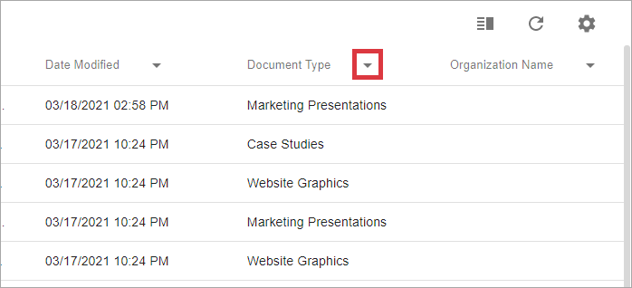
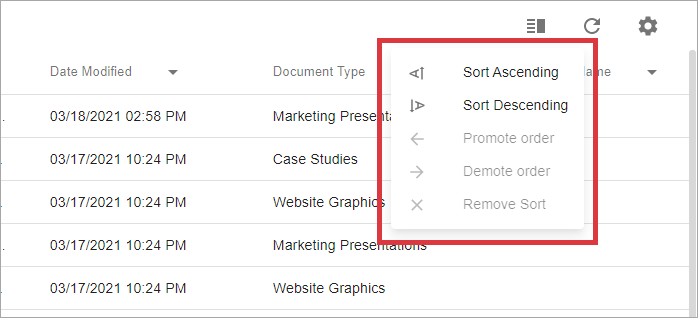
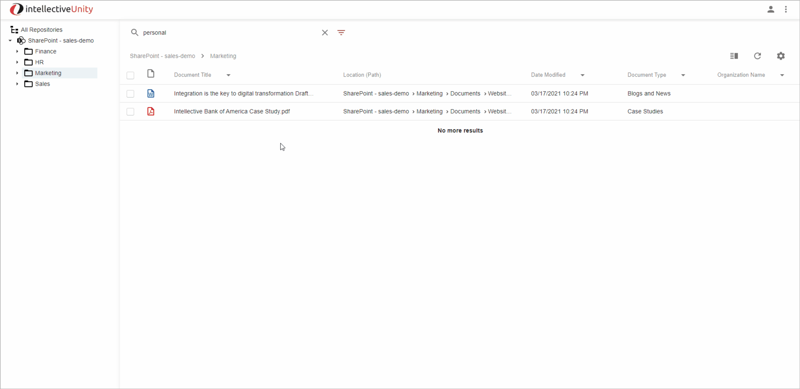
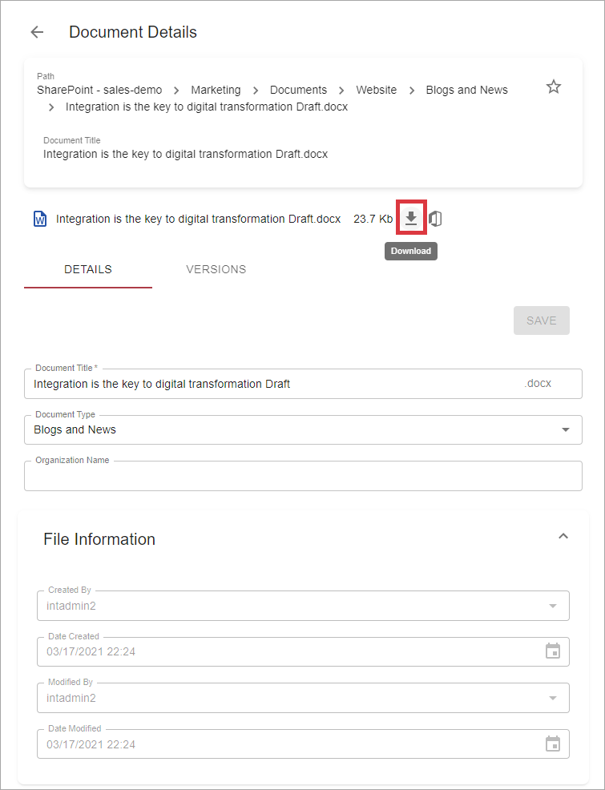

# Getting Started

Your Unity instance contains the following pre-defined SharePoint Sites and content. This is to give you a working example Unity’s capabilities working with different sites and documents:

- Finance
- HR
- Marketing
- Sales

After requesting your Unity instance, the requestor should have received an email detailing how to access your instance. The email contains:

- Two User Ids with passwords.  
    
    These IDs provide different levels of access:
    - User 1: Full access to all sites
    - User 2: Access only to the Sales and Marketing sites  
    
- The URL to use to log into your Unity instance.  
    
    To log in, go to the URL provided in your welcome email, and log in with one of the account User IDs provided.  

# Unity User Interface Overview

When a user signs into Unity the default behavior is to display a list of [Favorite](#favorites) files, which are files the user has tagged as a Favorite. 
For Evaluation purposes, a short list of files has been tagged as a Favorites.

## Simple Search

Use Simple Search to quickly find documents across all authorized SharePoint sites by typing in a related keyword or phrase.

Type in the word or phrase to search for in the `Enter on Document Title or Content` box at the top of the screen. Click `Search` icon or press `Enter` on a keyboard to execute search.
The Search results will update, returning all content with the search criteria found anywhere in the Document Title or Content:

## Folder View

Use the folder view to easily browse through the contents of folders in all of your connected sites and instances.

The demo instance contains a single SharePoint instance with multiple sites for you to browse through in one view. 
Unity has the capability to present a single continuous view of multiple SharePoint instances, together with other repositories like IBM FileNet, CMOD, CM8, Box, Alfresco, other CMIS repositories, and more. 

Click on a folder to display content within that folder and all subfolders under it.

- All Repositories 

    When the All Repositories Node is select any Simple Or Advanced search will search across all Configured Repositories.  
    For the Preconfigured Demo, only SharePoint is configured.  However, the only Repository is SharePoint.  However, Unity also includes other repositories (e.g., IBM FileNet, CMOD, CM8, Box, Alfresco, all CMIS supported repositories)

- SharePoint Instance

    When the SharePoint Instance Node is select any Simple Or Advanced search will search across all Configured Sites for the selected SharePoint Instance.  
    For the Preconfigured Demo only a single SharePoint Instance is provided.  However, multiple SP Instances are supported. 

- SharePoint Sites

    The Preconfigure Demo has been configured with the following four SharePoint sites: HR, Finance, Sales, Marketing.  
    When a user selects a SharePoint Site, all Simple and Advanced Search are restricted to the selected Site.    
    Note: It is possible to search across multiple specifically selected SharePoint Sites using the [Advanced Search](#advanced-search) SharePoint Sites search criteria.

- SharePoint Site - Folders

    The Preconfigured Demo has been configured with specific Folders, Sub-Folders and related Content for each SharePoint Site (see list above).   
    When a user selects a specific Folder, all Simple and Advanced Searches are restricted to the select Folder Content and All Sub-Folder Content.

## Search results simple Open file action

Clicking the Document Title on one of the search results will open the file in the Browser:

## Advanced Search 

Advanced search gives you powerful tools to find the exact document you’re looking for. 
You can quickly filter and narrow down your search results via multiple dimensions like site, filetype, modifier, custom metadata, and more. 

Click the Advanced Search Icon to open the Advanced Search Panel:

From the Advanced Search Panel, you can:

- Search by Title only, by the contents of the file only, by title and contents, or by either title or content. 

    Enter search values and select `AND` to return documents that both contain the value you entered in the title, and contain the value you entered within the document’s text.

    Select `OR` to find documents that match either the title value, or contain the content value in the document’s text.

    The fields will default to match what you previously entered in the `Simple` search view.

    Remove one of the values to only search by that criteria. For example, remove the `Title` value to only look in the document’s text.
   
    
    
- Search by File Types

    To only return documents of a particular type, click on the `File Type` dropdown and select the types of files you want the search to return. For example: MS Word, MS Excel, PDF, etc. 
    You may select multiple values to return multiple kinds of documents:
    
    
    
     Remove your selections to see all document types.
     
    <For Video/Gif Continue from last GIF and add to it a File Type Selection (e.g., MS Word, MS PowerPoint, PDF, etc, and select the Search button to show the updated results>

- Search by the user who last modified the file

    To show documents modified by a particular user, click on the `Modified By` dropdown and select the user’s name.
    
    <For Video/Gif Continue from last GIF and add to it a Modified By Search and select the Search button to show the updated results>

- Search by Date Modified Range

    To show documents modified at a certain date or time, enter values in the `Date Modified On or Before`, or `Date Modified On or After` fields. 
   
    Allows the user to restrict the search results based on the Date Modified. The user can enter a:
    - Enter a Date Modified On or Before to return documents last modified on or before that date 
    - Enter a Date Modified On or After to return documents last modified on or after that date 
    - Enter a date for both fields to return documents modified on or between those two dates. 
    - Enter the same date for both to return documents modified on that day.
    
    <For Video/Gif Continue from last GIF and add to it a Date Modified Range Search and select the Search button to show the updated results>

- Search by SharePoint Sites

    By default, Unity’s search shows you documents from everywhere, in all of your connected sites.  
    If you only want to view documents from a particular site or a set of sites, click the `SharePoint Sites` dropdown and check the sites you want to search:
   
      
    
    <For Video/Gif Continue from last GIF and add to it a selection of Multiple SharePoint Sites and select the Search button to show the updated results>

- Search by Custom Fields

    Some SharePoint documents may have additional associated metadata that describes the file. 
    For example, `Customer Name` or `Order ID.` If the administrator has configured Custom SP Metadata fields for specific SP Sites, you can search by these fields in the Custom fields section. 
    Click on the `Custom Fields` section to expand it and enter values for the fields you’d like to search on.

    For your Preconfigured Demo instance, example Custom Fields have been created for the following:

    - Organization Name (Text Field)
    - Document Type (Choice List)

    <For Video/Gif Continue from last GIF and add to it Custom Field search including Document Type and /or Organization Name and select the Search button to show the updated results>

Click the `Search` button to execute your search and see the results in the panel on the right.

To clear your changes and return to the default search settings, click the `Reset` button.

<For Video/Gif Continue from last GIF and select the `Reset` button to show the Search Criteria fields are cleared>

## Saved Searches

You can save frequently used searches to quickly access them in the future.

- Enter the search criteria you’d like to use, then click the `Advanced Search Settings` ellipses and select `Save As`
- Enter a name for the search and click `Save`
- To access your saved searches, click on the [Navigation Settings Menu](#navigation-settings) and select a search listed under the `Saved Searches` section

When a Saved Search is select, the Simple and Advanced panel UIs are updated to display the Saved Search Criteria, and the search is executed.
  

## Favorites

You can tag frequently accessed documents as `Favorites`, providing fast access to them without searching.  

You can tag/un-tag a document as a `Favorite` by selecting the [Favorite action](#favorite-on--favorite-off).  
Also you can do this in [Document Details panel](#details) and in [Detail view](#detail-view).

To display the list of your Favorites select `Favorites` from the [Navigation Settings Menu](#navigation-settings):

|**Note**: When you first log on, the Favorites are shown by default.

<For Video/Gif log in and show that Favorites are displayed by default.  Select a document and Un-tag it as a Favorite using the Content Action Favorite to show that it is removed.  
Then go to the Folder View and open a folder to display a list of documents.  Tag one as a Favorite using the Content Action Favorite, and then open the Navigation Setting Menu and select Favorites to show the List of Favorites>

## Create Document

You can easily add new documents to your repositories, right from Unity.

Click the `Create` button to add a file to a `SharePoint Site > Folder`:

|**Note**: The `Create` button is only displayed when you have selected a Folder in the Folder View. If All Repositories, SharePoint Instance, or a SharePoint Site node is selected in the Folder View, the `Create` button is hidden.

The New Document dialog box will be displayed:
 

 
 You can add documents two ways:

- Drag and Drop: Click on a document in a folder on your desktop, and drag it onto the `Drop files to attach` box on the screen. 
- Browse and Select: Click the Upload icon in the `Drop files to attach` box. You will be prompted to select.
 
After dragging and dropping, or browse and selecting a file, you will be prompted to enter metadata for the file.
- Enter a document title to be used for the document added. This can be different from the filename.
- You may optionally provide custom metadata field values, if prompted. Required fields will be marked with a red icon.
    
    For the Preconfigured Demo custom metadata fields for the following have been configured:
    - Document Type (Choice List)
    - Organization Name (Text)
 
- Once all required fields are entered, click the `Create` button.
- Your document will be securely uploaded into the system.

< From the Video/Gif, starting from last GIF where Create button is displayed, add a document via Drag and Drop and then provide values for Document Title, Document Type and if appropriate (optionally) Organization Name.  Then select the Create Button and show the Document was added to the folder>

## Search Results

The Search Results are displayed and updated when the following occurs:

- By default, when you log into Unity, files you previously tagged as Favorites are displayed
- You perform either a Simple or Advanced Search
- You select a Saved Search
- You select a Node in the Folder View
- A new document created and added to the folder

<For the Video/Gif show the Search results defaulting to Favorites on Log in, updated after a Simply, Advanced Search, after selecting a Saved Search, and selecting a node in the Folder View>
 
With Unity, you can customize how you view your search results. You can change the look and feel, columns shown, sort order, and more. 
To customize the Search Results Panel, click on the gear icon in the upper right:

### Grid columns

To make a column visible or hidden, or to control the order in which the columns are displayed, select the `Grid Columns` menu item.
Customize columns dialog appears:

For a given field, toggle the Visible toggle switch to the right (Red) to make that column visible. Toggle the switch to the left (Gray) to hide the column.

Any custom fields configured to the SharePoint sites will be displayed as columns.  

For the Preconfigured Demo, custom fields will be configured for:
- Organization Name
- Document Type

To change the column order, mouse over the Dots icon to the left of the Column name, and then drag and drop the Column in the order it should be displayed. 
For example, drag a column from the bottom to the top of the list to see it on the left side of your screen when searching.

When you’re done making changes, select the `Apply` button. Your changes will be saved and kept the same each time you log into the system.

<For the Video/Gif, select the Gear Icon and the Grid Columns menu to open the Customize Columns UI 
Then change one Hidden Field to Visible and one Visible Field to Hidden. 
Then mouse over one of the Visible Field Dot Icon and drag and drop it in a new location.
Then select Apply Button and note the changes>

### Grid Display Density: Usability Features

Unity can show information in a more compact or a more expanded form, depending on how much data you’d like to see on the screen at once.

To change the grid density of the rows displayed in the search results, click the `Grid Display Density` option and select the view you’d like to use.  
Three options are provided:
- Default
- Medium
- Compact

Click the `Apply` button to save your change. 

### Sorting

Unity gives you powerful tools to sort your results, making it much easier to narrow down and identify the documents you want to find. 
You can use a simple sort on one column, or create multiple related column sorts to hone in on specific information.

#### Quick Sort

- To quickly sort a column, mouse over the Column Name, and click on the arrow icon that appears immediately to the right:

    

    This will sort the column in ascending order. 
- Click again to sort in descending order
- Click a third time to remove the sort

<For the Video/Gif, show mousing over a column, and have the sort arrow display.  Click this arrow to sort ascending, show column is sorted ascending.
Then mouse over again and select arrow and sort descending
Then mouse over again and select to remove the sort>

#### Sort Menu

To sort a column, you can also click the down arrow to the right of the column heading:

The sort options are displayed:

 
To set the sort order for the selected column, select either `Sort Ascending` or `Sort Descending`. Ascending will order elements like `1, 2, 3` or `Alpha, Beta, Charlie`, while descending will order elements like `10, 9, 8` or `Zulu, Yankee, X-ray   `.

If you select a sort for multiple columns, a number will appear after the column names, indicating in which order the columns are sorted.

<For the Video/Gif, show selecting a column and then select Sort Ascending > show the search results are sorted by the selected column in Ascending Order. 
Then select the same column and select Sort Descending > show the search results are sorted by the selected column in Ascending Order. 
Then select a different column and select Sort Ascending or Descending > show that numbers 1 and 2 are now displayed next to the selected columns>

 
To control the sort order and have a different column be sorted first, select the down arrow to the right of the column heading and select either Promote Order (to increase that column’s precedence in the sort order) ,or Demote Order (to lower that column’s precedence in the sort order). 
For example, if you want to sort by Document Title first, and then by Date Modified, promote Document Title until it is labelled `1`, followed by Date Modified labelled `2`.

To remove the Column from Sort, select the Remove Sort menu item from the dropdown.

<For the Video/Gif, show that Promoting a Column Heading currently listed as Sort Order #2 (Doc Title in example above), will change it to Sort #1, and the current Sort Order #1 is demoted to Sort Order #2 (Date Modified in example above).  
Then select Remove from Sort, to remove the Column from Sort.>
 
## Actions on Search Result Rows

Once you’ve located the document you’re looking for, you can take a variety of actions on it.

Click on the document name to quickly open the document for viewing. For more actions, mouse over the document name and then click on the vertical ellipse icon consisting of three dots to the right of the name:

Click on the action to perform it.

### Open in browser

Opens the file in your browser for quick viewing.

<For the Video/Gif, select the vertical ellipse icon and show the list of actions and Select Open browser, show the results of the action>

### Open in app

Opens the file in the related desktop application.  
Only applicable for Microsoft Office documents.  

<For the Video/Gif, select the vertical ellipse icon and show the list of actions and Select Open in app for a MS Office Document, show the results of the action>

### Copy Link

Opens a window where the user can copy the URL to the selected file:
 
 
 
This URL provides a fast means of sharing the document with other users, without creating a duplicate copy.

Click `Copy` to copy the URL to your clipboard, then paste (Ctrl-V) to paste the link into an email, message, document, or other location.

You can optionally select to limit the number of people who can access the link.  Select `Specific People` from the menu and choose the people that you want to access the document via the link. 

<For the Video/Gif, select the vertical ellipse icon and show the list of actions and select Copy Link, show the results of the action, by pasting the copy link into a new browser tab>

### Download

Downloads the selected file to your default file download location.

<For the Video/Gif, select the vertical ellipse icon and show the list of actions and select Download, show the results of the action>

### Delete

Deletes a document from the system.

You must have security rights to delete the file for this action to be available.

You will be shown a Delete document confirmation prompt: 
- If you select `Yes`, the file will be deleted
- If you select `Cancel`, no changes will be made and the prompt will be closed

<For the Video/Gif, select the vertical ellipse icon and show the list of actions and select Delete, show the results of the action>

### Rename

Renames the file.

Enter a new name for the file in the dialog box:

 

Click `Rename` to confirm. The file will now be searchable and labelled by the new name.

Select `Cancel` to close the Rename dialog box without renaming the file.
 

<For the Video/Gif, select the vertical ellipse icon and show the list of actions and select Rename, and then Rename the File and select the Rename Button, and show the results of the action>

### Move to

Moves the file to another SharePoint site or folder.

You may move files by dragging and dropping them, or by selecting the `Move to` option. 

<Video/Gif to show both options>

- Using `Move to`
    
    Click the `Move to` action, then select the site and folder you wish to move to.  Select the `Apply` button to move the document.

 
 
- Using Drag and Drop

    - Click on the file you want to move, then drag and drop the file from the Search Results to a SharePoint Folder on the Folder View. 
    - After dropping the file, you will be asked if you’d like to move or copy the file. Moving will relocate the file to a new location, while copying will duplicate the document and place the copy in the new location. 

To cancel the Move/Copy action, click outside of the selection box.

 
<For the Video/Gif, drag and drop a file in the search results into a SharePoint Site-Folder (where the file does not current exists), after dropping the file select Move to at the prompt, and show the results of the action that the file is moved from the current folder and to the destination (dropped) folder>

### Copy to

Copies the File to another SharePoint Site / Folder.

You may copy files by dragging and dropping them, or by selecting the `Copy to` option. <Video/Gif to show both options>

- Using `Copy to`

    Click the `Copy to` action, then select the site and folder you wish to copy it to.  Select the `Apply` button to copy the document.

- Using Drag and Drop

    See Move Action above.

<For the Video/Gif, drag and drop a file in the search results into a SharePoint Site-Folder (where the file does not current exists), after dropping the file select Copy to at the prompt, and show the results of the action that the file is still maintained in the current folder but also copied to the destination (dropped) folder>

### Details

Clicking the Detail action displays a Document Details window with the following information:
- Path to the file 
- Document title   
- Favorite icon, indicating if you previously favorited this document and allowing to tag a document as a Favorite or remove from Favorites
- Link to Open the file in your browser:

     
    
- Icon to Download the file:
    
     
    
- Icon to Open the file in desktop app:

     

- `DETAILS` Tab
    
    The Details tab displays metadata, which can be modified by an authorized user.  
       
    Standard SharePoint metadata:
    - Document title
    
    For the Preconfigured Demo, custom fields will be configured for:
    - Document Type
    - Organization Name
    
    The Details Tab will be displayed by default.
    
- `VERSIONS` Tab
 
    The Version History tab displays information on each version of the file. 
    Each time the file is modified, SharePoint creates a new version of the file to track the changes made. 
    From this tab, you can see and interact with the current version of the document, as well as all prior versions.
 
<For the Video/Gif, select the vertical ellipse icon and show the list of actions and select Details, 
Then modified the Standard and Custom Metadata (Document Title, and Document Type) and select the Save button
Then select the Versions tab to show the Versions tab information>

### Favorite On / Favorite Off

You may tag a file as a favorite or remove a file as favorite, by selecting the `Favorite` action.

Once the file is selected as a favorite, the `Favorite` action appears with a Yellow Star:

 

You may un-tag a file as a favorite by selecting the `Favorite` action again. 

Once the file is de-selected as a Favorite (or not previously selected as a Favorite) the `Favorite` action appears with a Star that is not filled in:

 

<For the Video/Gif, select the vertical ellipse icon and show the list of actions and Select the Favorites action for a document that is Not already tagged as a Favorite, and show the Favorites Action Icon has now change to display Gold Star.
Then select the Navigation Settings Icon and Favorites Menu Item and show how the document now displays as a Favorite.
Then select the vertical ellipse icon and show the list of actions and Select the Favorites action again to now Un-tag the document as a Favorite, and show that this action removes the document from the list of Favorites>

## Actions on Multiple Selected Documents

With Unity, you can take action on multiple documents at once.  
Click the checkbox to the left of a document to select it. To take action on multiple documents, select multiple documents and then click the `Actions` button in the upper right:

 
 
You may take the following actions on multiple selected documents:
- Download
    
    Downloads the selected files as a single zip file.
- Move to / Copy to
    
    Shows the same `Move to / Copy to` interface used for single documents, allowing you to copy or move multiple documents at the same time.
 

<For the Video/Gif, select multiple documents and show how the Action Menu has now enabled.
Then select the Download Action and show that all selected documents are download as a Zip File.
Then select the Copy To Action which will open the Copy To Pop-up UI
Then select a Destination Folder, which will enable the Select Button.  Select the Select Button and show that the documents were copied to this Folder>

## Detail View

Unity provides an additional Detail View to allow fast browsing and comparison of documents. To activate it, click the `Detail View` toggle button in the upper right of the search results screen:

  

You can click the button again to easily toggle between `Detail View` and standard `List View`:

 
The Detail View left panel displays the list of files returned from the search.
The Detail middle panel displays the same details information as listed above when the user selects the [Details action](#details). 
You may click on documents in the left panel to refresh the middle panel with their details. In this way, you can quickly switch between documents to compare details or identify the document you’re looking for.
 
You can open Detail View for all documents returned by a search, or you can first multi-select the specific documents you want to view. 
For example, clicking the checkbox next to three documents, then selecting the Detail View toggle, will show only those three documents in Detail View. If no checkboxes are selected, all documents will be shown .

<For the Video/Gif, execute a search that returns several documents.  
Without selecting Any documents select the Details View and show all documents displayed in the Details View.
Then toggle the View back to a List View, and now from the List View select three (3) documents.  
Then toggle the View back to the Details view and show Only the selected documents are displayed.>

### Order By

Click the `Order By` dropdown to change the order by which files are displayed in the Detail View. 
The Detail View will sort the contents based on the column you select:

 

## Appended Searches

Sometimes, it takes multiple searches to find and assemble the documents you need. 
Unity gives you the ability to collect documents across multiple searches and then download, view, or take action on them.

You can Append documents across multiple searches as follows:
- Perform a search, then select the documents you wish to `keep` by clicking the checkbox next to each document
- Execute a different search or browse to a different folder, then select more documents by clicking the checkbox 
- Repeat as many times as you need to identify the collection of documents you need
- Once all documents are selected, click the `Detail View` toggle to view a complete list of their selected documents across multiple searches. You can also take action on one or all of the documents.

<For the Video/Gif execute a search and select a few documents.
-	first example below has three (3) selected documents
Then execute a different search and again select more documents.
-	Second example below has four (4) selected documents
Once the searches are completed, select the Details View Toggle Switch to view the Appended list of Selected Documents.
-	Append Search example displays the seven (7) selected documents >

## Menus

Unity provides the Account settings and Navigation settings top-level menus.

### Account Settings

The Account Setting displays your logged-in user account information:

 
<For the Video/Gif select the Account Settings Menu> 

### Navigation Settings

 

The Navigation Setting Menu provides access to the following:
- Help Guide  
        
    Accesses this Help Guide.
    
- Administration Console     
        
    Allows your organizations Administrator’s to Configure Unity. For the Preconfigured Demo the Unity Administration Console UI has been set to Read Only to allow evaluators to view what configuration options are available.  
             
    - Connectivity:  
      Allows the Administrator to indicate the following information:
      - SharePoint Base URL
      - Allowed Sites: SharePoint Sites Unity is Authorize to Access
      - Denied Sites: SharePoint Sites Unity is Denied Access
      - SharePoint Custom Metadata Properties configured for Unity access    
    - Unity Authentication  
      Allows the Administrator to indicate User Authentication information    
    - System Account  
      Allows the Administrator to indicate System Account Information

- About Unity
- Favorites  
    
    Shows a list of favorite documents. See [Favorite On/Favorite Off](#favorite-on--favorite-off) for details. 

- Saved searches  
    
    Shows a list of saved searches. See [Saved Searches](#saved-searches) for details.

<For the Video/Gif select the Navigations Settings Menu, to show the list of items> 
 
<For the Video/Gif select the Navigations Settings Menu: Administration Console and select each sub-menu ID: 
-Connectivity
-User Authentication
-System Account>
