# Purpose

The purpose of this document is to provide an end user guide for the use of Unity for nCino Content Management functions accessible with the nCino and Salesforce Lightning User interface. 
This document is intended for end users and not administrations responsible for configuring and deploying of Unity components.

# Accessing Archived nCino Content from Document Manager

Once content is archived from nCino to an ECM (e.g., IBM FileNet, OpenText, SharePoint, Box, etc.) the user can select the Download Link from nCino’s Document Manager to Display the Document.  

nCino modifies the behavior of the Document Manager Download Link for archived Content, to call Unity to retrieve and display the document from the ECM.

Once the Download Link is selected the document will Display in the Browser (e.g., based on the Browser settings and the File Mime Type):

[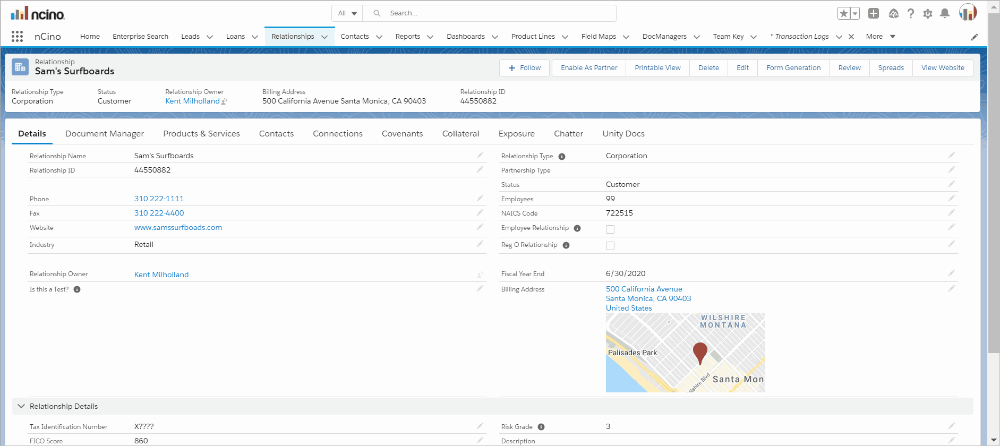](unity-ncino-user-guide/images/Accessing-Archived-nCino-Content-from-Document-Manager.gif)

# Accessing Unity Search

Unity Search Templates are configured in the native Unity application (e.g., outside of nCino and Salesforce) and can be expose to any nCino and or Salesforce UI. 
Search Templates provide the user with the capability to search for content stored in either one or multiple ECMs.

Unity Search can be accessed from:
- nCino Document Manager
- Enterprise Search

## nCino Document Manager

All nCino User Interfaces related to Loans, Relationships, Collateral, Product Packages, etc. where Document Manager is provided can be configured with Unity Search Templates to return a list of documents linked to the specific nCino Loan Number, Relationship ID: 

[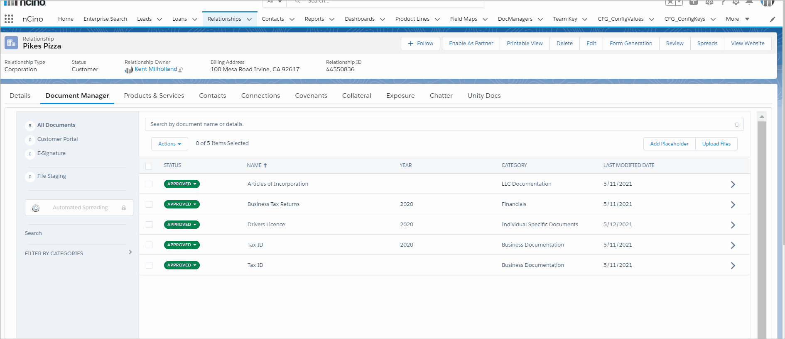](unity-ncino-user-guide/images/nCino-Document-Manager.gif) 

## Enterprise Search

Available from the Main Salesforce Menu, provides the capability to perform an Enterprise Search across all archived nCino data stored in an ECM.
Unity Enterprise Search can search all content within an ECM (not limited to nCino Content) as well as multiple ECMs, from a single search:

[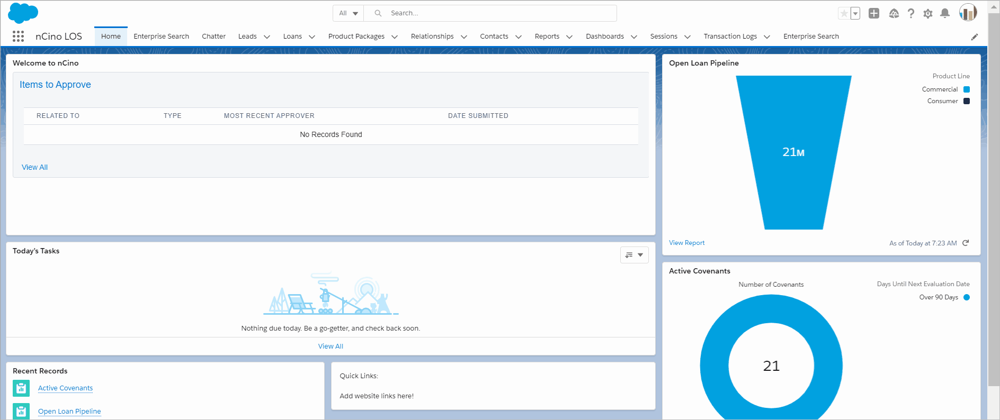](unity-ncino-user-guide/images/Enterprise-Search.gif) 

# Unity Search Templates

Unity Search Templates are configured in the Unity Application and then exposed to any nCino or Salesforce user interface.

The Unity Search Templates include:
- Search Criteria
- Search Results
    - Actions related to Search Results
- Add (New) Content

## Search Criteria

Search Criteria can be configured for any Property that exists in the Unity Enterprise Search Index.  

This includes Properties from the ECM as well as other Data Sources (e.g., via Extension Unity can leverage its transformation and discovery services to enhance ECM Property with nCino data and other Financial source data).

The Search Criteria can also be configured to automatically pull in data from nCino and Salesforce to leverage as the Search Criteria.  
For example, a search configured to an nCino Loan can automatically pull in the nCino Loan Number and use this as search criteria to return only documents for a specific Loan.  
Search Criteria can be configured as: Read Only, Hidden, Required, or Optional.  User can enter value for the configured search criteria to refine the search and limit the returned results.

Search Criteria Actions:

- Search

    When the user selects the `Spyglass` button, the search is performed.

- Reset

    When the user selects the `Reset` button, search criteria are reset.

[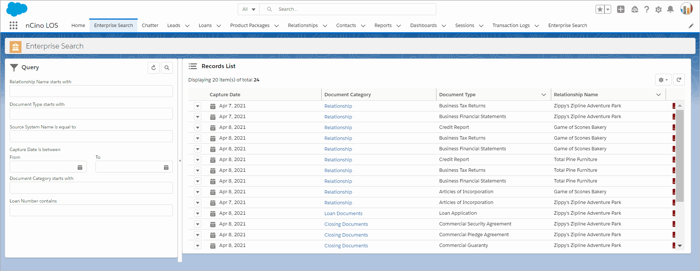](unity-ncino-user-guide/images/Search-Criteria.gif) 
 
## Search Results

Search Results are a table, where each row is a file returned based on the Search Criteria, and each column represents an ECM Property.  These properties can be the same or different from the Search Criteria.

The Search Results are sortable in ascending and descending order by selecting the column heading.

The columns can be displayed or hidden using the `Gear` button, which opens a `Select Fields to Display` user interface.

 
 
## Search Results – Actions

Search Results actions are configurable based on the User’s Role, such that only actions the user is authorized to perform are displayed.
The user can access the list of actions by selection the down arrow on the content row:

[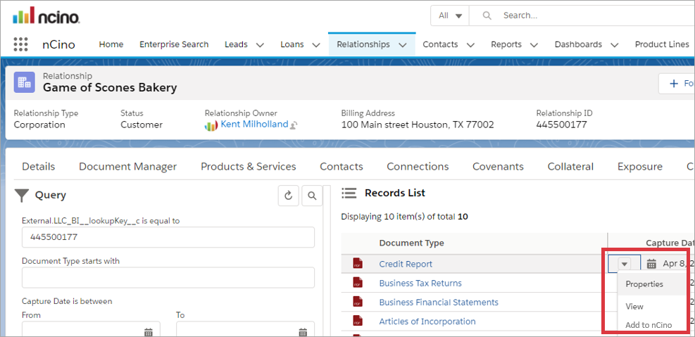](unity-ncino-user-guide/images/row-actions.png)  

Standard actions include:

### Properties (Basic)

Display a list of the Content Properties, which can be modified by the end user based on Role (e.g., Authorization):
    
[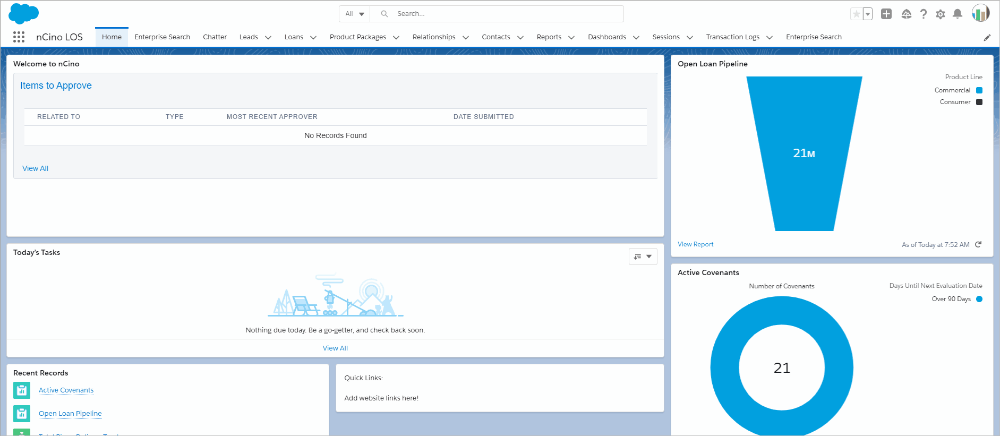](unity-ncino-user-guide/images/Actions-Properties.gif) 
    
### View

Opens the selected document in the browser (e.g., based on the browser setting and file Mime Type):

[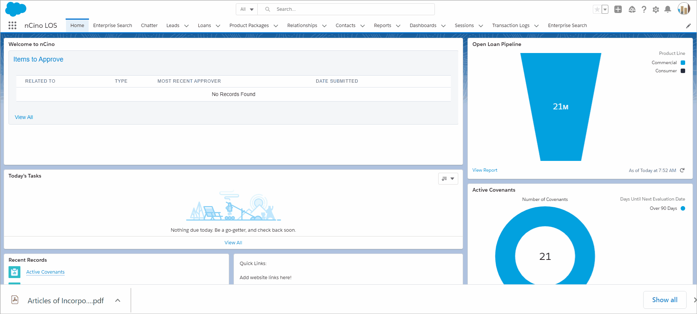](unity-ncino-user-guide/images/Actions-View.gif)

### Add to nCino

Provides the capability to Add an archived Document from an ECM to a new nCino Placeholder.
- A Copy Document to Placeholder user interface is selected where the user can select the Document Category (i.e., based on nCino configured Categories) and either select or enter a Document Name for the new Placeholder.  
- Once the `Copy` button is selected the file is downloaded from the ECM and added to the Placeholder.
- The Document is added as a new file, which will then be Archived as a new document in the ECM later in the process cycle (e.g., when the Loan reaches the `Booked` State).

[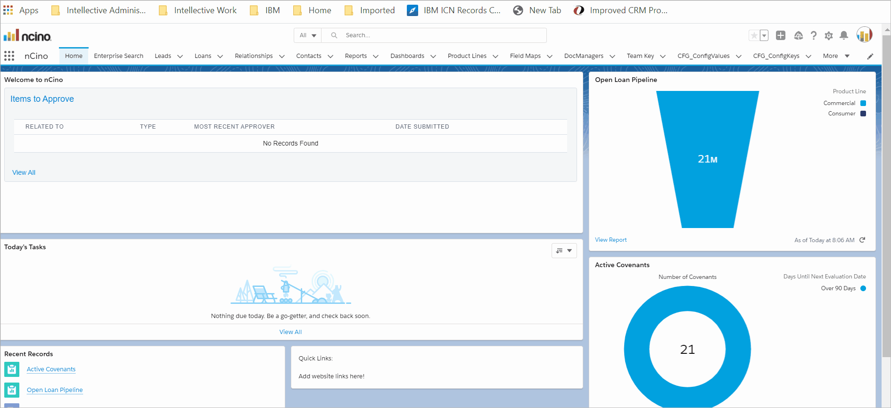](unity-ncino-user-guide/images/Actions-Add-to-nCino.gif)

Additional Unity actions available:

### Download

Downloads the document to the user’s desktop.

### Delete

Allows an Authorized User to Delete a Document.

### Check Out

Allows an Authorized User to perform a FileNet function used to Check Out a file. 
When a file is Checked Out by a user, another user cannot Check Out the same file.  However, it can still be viewed.

### Check In

- Allows an Authorized User to perform a FileNet function used to Check-In a document that was previously checked out.
- Opens the Check-In user interface allows the user to browse or Drag and Drop the field and update the content Properties.
- The user can also indicate if the Checked In document will be a new Major or Minor Version.
- The `Check In` action is performed when the `Save` button is selected.

### Cancel Check Out

Allows an Authorized User to perform a FileNet action used to Cancel a Check Out.

### Properties (Expanded)  

#### Document actions

Properties Tab displays a list of the Content Properties, which can be modified by the end user based on Role (e.g., Authorization).  
Properties Tab includes document actions (listed above):
- Download
- Check In 
- Check Out
- Cancel Check Out
- Delete
- View

[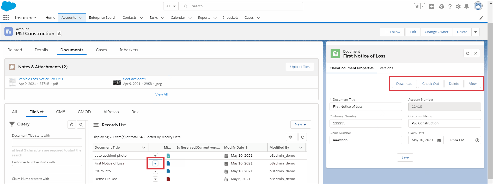](unity-ncino-user-guide/images/properties-expanded.png)

#### Version actions

Versions Tab displays a list of document versions and provides access to version actions:

- Promote
    
    Allows an authorized user to promote a minor version to a new major version (e.g., change version 1.1 to version 2.0)

- Demote
    
    Allows an authorize user to demote a major version of a document to a prior minor version (e.g., change version 2.0 back to version 1.1)

- Make Current Version
    
    Makes a Prior Version the Current Version.

[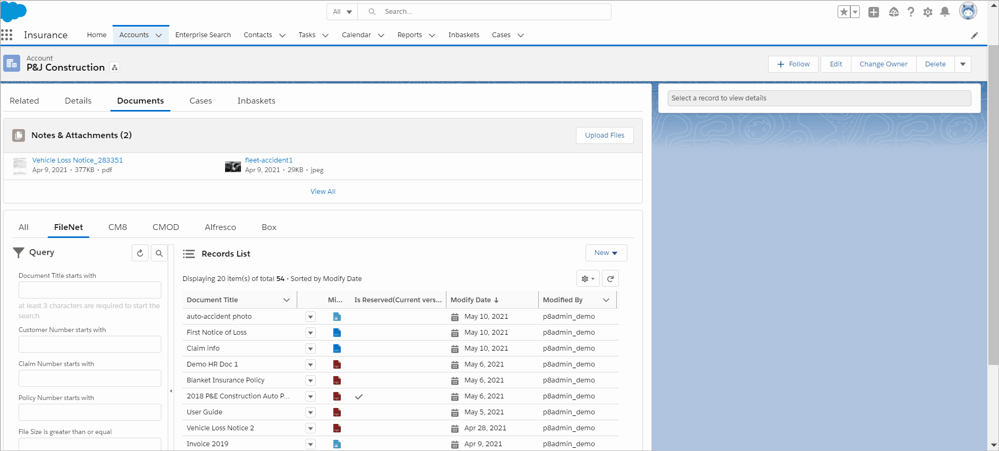](unity-ncino-user-guide/images/Actions-Expanded-Properties.gif)

## Add Content – New Button

Unity provides the capability for a user to Add (i.e., upload) a document directly to the ECM from a User Search Template.

When the `New` button is selected a configured Choice List of Document Types is displayed.

When the user selects a Document Type Choice List value, an Add Document Type user interface is open which will allow the user to enter the ECM Properties (i.e., which the document can later be retrieved by) and select the file to upload, by using Browser or Drag and Drop.

The Add Document Type user interface can also automatically pull in one or more properties from the nCino / Salesforce user interface (e.g., Loan Number, Relationship ID, Account Number, etc.) to reduce the amount of data entry required by the user and ensure the content is correctly indexed.

The added document can then be returned in the search.

[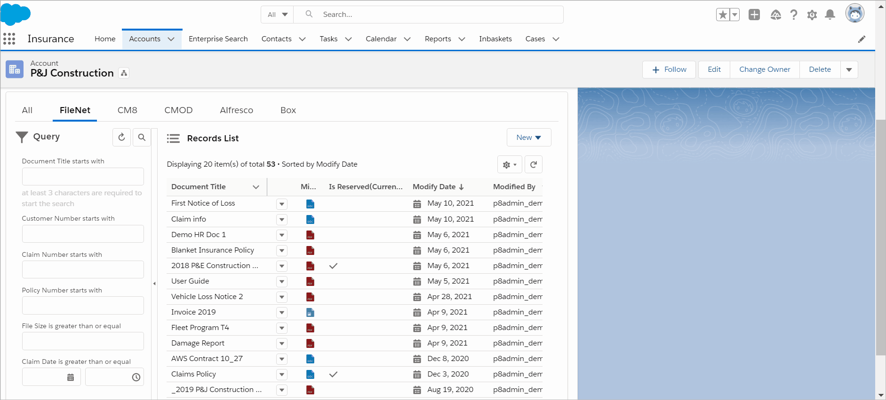](unity-ncino-user-guide/images/Add-Content-New-Button.gif)

|**Note**: The properties displayed on this user interface are configurable and will be defined based on the Document Properties related to the Document Type selected. 
