This document describes the installation/configuration/use and environmental requirements of the Unity IBM Content Navigator Plug-In.
The Unity ICN Plug-In allows Unity functionality to be exposed in the UI tier of IBM Content Navigator:


The integration can be configured in one of three modes by the IBM Content Navigator administrator:

1.	One icon per Unity instance - This mode displays one ICN feature icon per Unity instance.
2.	One icon per Unity solution - This mode displays one ICN feature icon per Unity solution.
3.	One icon per Unity tab - This mode displays one ICN feature icon per Unity tab in all solutions.

The different integration modes are explained in the section: [Configuration of the Plug-In](#configuration-of-the-plug-in).

The Unity ICN Plug-In documentation assumes that you have both a working instance of IBM Content Navigator and Unity. If you any questions regarding the installation/configuration of these products, please refer to their respective documentation:

[IBM Content Navigator documentation](http://www-01.ibm.com/support/knowledgecenter/SSEUEX_2.0.3/contentnavigator_2.0.3.htm)
[Unity documentation](https://docs.intellectivelab.com)

In order to install/configure the Unity ICN Plug-In the following steps must be completed.

# Single Sign-On Configuration (SSO)

In order to the Unity Plug-In to not display a login dialog whenever the plugin is first invoked, Single Sign-On must be configured for the Unity ICN Plug-In. This section describes the architecture and setup instructions for Single Sign-On for the Unity ICN Plug-In.

## Overview

The Single Sign-On (SSO) works by configuring the Unity ICN Plug-In component to be a trusted sub system of IBM Content Navigator. This means that Unity will trust the authentication made by IBM Content Navigator and not require the user to re-authenticate when using the Unity ICN Plug-In.
As part of the setup of IBM Content Navigator and Unity they both need to be configured to connect to an external service for authentication and authorization. Since they are two different products, they both need to be configured to connect to an external service.
IBM Content Navigator does not connect to a directory for authentication. It uses one of the configured repositories for authentication. This can be configured per desktop:


Normally IBM Content Navigator and Unity ICN Plug-In will be configured (indirectly) to use the same directory service as shown in the diagram below. When both products are configured to connect to the same directory service the SSO/authentication and authorization is completely transparent.
The authentication of the user is done by IBM Content Navigator. That authentication is carried on to the Unity ICN Plug-In using SSO:


The two green arrows show the connection from IBM Content Engine to its directory service.

In more complex environments IBM Content Navigator and Unity could be configured to connect (indirectly) to two different directory services.
This is a supported configuration, but there are some limitations that the installer/configurator need to be aware of.

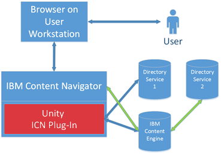

The limitations are as follows. The user name for example `joe.public` should be the same in `Directory Service 1` and `Directory Service 2`. The passwords do not need to be kept in sync or be the same value in the two directory services.
Important note: time should be correctly synchronized with UTC on both servers.

## Additional SSO limitations

- Currently SSO works only for FileNet CE, PE and ICM repositories.
- Repositories must be accessed by EJB / IIOP transport (not MTOM). Repository URL should look like: iiop://[ce_server]:2809/FileNet/Engine. Port number may be different. Please consult with IBM FileNet documentation regarding enabling IIOP transport for FileNet.
- Unity application server must be Web Sphere 8.5+.
- Actual FileNet client files (`Jace.jar`, `javaapi.jar`, `pe.jar`) must be replaced in `WEB-INF\lib` folder WAR file inside Unity EAR file before deployment.
    Note, that in the WAR these files may have built number suffix, i.e. `jace-5.2.1.4.jar`. Delete these files in the WAR and add them from actual FileNet installation (as is, without renaming them).
- Trust Association Interceptor (TAI) must be configured on application server where Unity is deployed (custom library deployed; custom login modules created). That process is explained below.

## Generate a Unique SSO Key

Unity distribution package contains a utility `vu-utils.cmd / vu-utils.sh` under `config/tools` directory. This utility can be used to generate SSO key with the following command:

**Generate key to command line**

```
vu-utils.cmd -generateKey -length 128
```

The length of the key is 128 bytes in the example above. Please see below for a discussion of the key length.
Randomly generated key will be printed on the screen. To place key to a file rather than to the screen following command can be used:

**Generate key to file**

```
vu-utils.cmd -generateKey -length 128 > key.txt
```

Key would be printed into the file `key.txt` in same directory with the utility. Key should look like `E5ubhLkzPex1IwO6zsviBA==`.

SSO encryption uses AES encryption algorithm, length of the key determine how strong encryption is.
Encryption/decryption with AES with key length of 128 bit should work on general Java runtime distributions without any modifications.
Encryption/decryption with AES with key length of 256 bit can be used only on Java runtime distributions with updated JCE policies to remove encryption restrictions.

JCE policy update is not required to generate a key, it is required to encrypt/decrypt with 256-bit keys. `vu-utils.cmd` also supports encryption and decryption options, same note about key length for AES algorithm applies to this utility, i.e. if key length is 256 bits for AES cipher, Java runtime which is used to execute this utility should have updated JCE policies.

## Update Unity Configuration XML File

Insert the following `SSO` section into the Unity Configuration XML File if it is not already there:

```xml
<Configuration>
 ...
 <SSO>
  <SSOEnabled>true</SSOEnabled>
  <InvokeJAASValidation>false</InvokeJAASValidation>
  <SSOAuthenticationPlugin class="com.vegaecm.vspace.plugins.sso.SSOVutAuthenticationPlugin">
   <Parameter name="stanza" value="TrustedLogin"/>
   <Parameter name="key" value="E5ubhLkzPex1IwO6zsviBA=="/>
  </SSOAuthenticationPlugin>
 </SSO>
 ...
</Configuration>
```

The key value above `E5ubhLkzPex1IwO6zsviBA==` represents a unique authentication key for SSO that was generated in the preceding section. Please insert the key that was generated instead of the value shown.

## Update JCE Policy files in IBM WebSphere

In order for the SSO configuration to work the IBM WebSphere JCE Policy files must be updated to enable strong cryptography (AES-256).

The updated JCE Policy files can be downloaded from IBM's web site. Note that an IBM id is required in order to download the files.
The instructions for downloading and updating the JCE Policy files can be found [here](http://www-01.ibm.com/support/knowledgecenter/SS8JFY_7.5.0/com.ibm.lmt75.doc/com.ibm.license.mgmt.security.doc/lmt_scr_downloading_installing_jce_policyfiles_max.html?cp=SS8JFY_7.5.0%2F0-8-2-0&lang=en).

## Add Unity Login Module to IBM WebSphere

Add TAI login module binary into WebSphere Application Server installation. File `vu_trusted_login-1.0.0.jar` can be found in distribution package under `\config\integration\appservers\was\lib.ext\vu_trusted_login-1.0.0.jar` and should be placed in `WAS_HOME\AppServer\lib\ext\`.

## Configure Unity Login Module to IBM WebSphere

New login module should be registered using the following steps:
- In WebSphere Application Server administration console navigate to `Security > Global Security`, under Java Authentication and Authorization Service select `Application logins`.
- Click `New`, Alias should be set to `TrustedLogin`.
- Click `New...` to add JAAS login modules.
- Set `com.vegaecm.security.login.IDLoginModule` for Module class name, click `Apply`.
- Click `New...` to add another JAAS login module, set `com.ibm.wsspi.security.common.auth.module.IdentityAssertionLoginModule` for Module class name, click `Apply`.
- Make sure that in resulting table module `com.vegaecm.security.login.IDLoginModule` is REQUIRED with Model order = 1 and module `com.ibm.wsspi.security.common.auth.module.IdentityAssertionLoginModule` is REQUIRED with Module Order = 2.

## Configure LTPA Token Timeout in IBM WebSphere

The LTPA Token Timeout should be increased to the max time users are expected to maintain a session with the server. This would normally be 12 or 24 hours. The timeout is set in minutes in WebSphere.
To set the timeout perform the following steps:
- In WebSphere Application Server administration console navigate to `Security > Global Security -> LTPA`.
- Set the LTPA timeout as shown below. The timeout is set in minutes.
- Click `Apply`.

    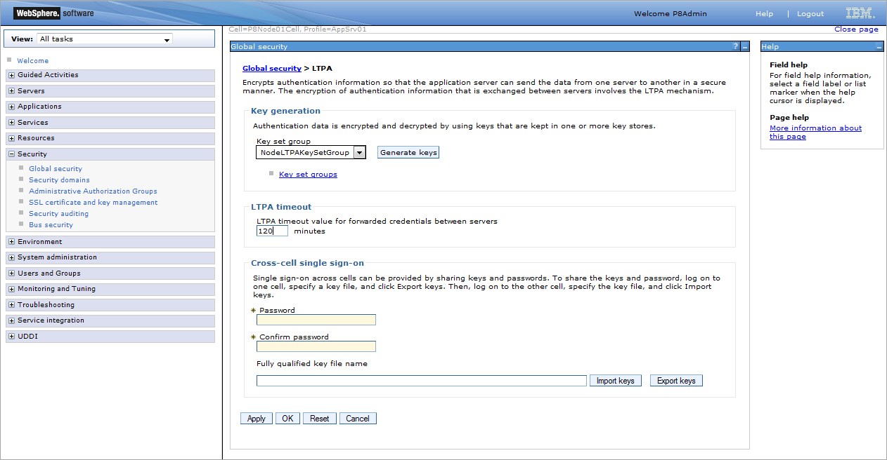

## Restart IBM WebSphere Application Server

Restart IBM WebSphere Application Server in order for the changes made to take effect in WebSphere.

# Unity ICN Plug-In Configuration

In order to use the Unity ICN Plug-In in IBM Content Navigator the Plug-In needs to be registered with IBM Content Navigator.
This process is described in the IBM Content Navigator manual in the section [Registering and configuring plug-ins](http://www-01.ibm.com/support/knowledgecenter/SSEUEX_2.0.3/com.ibm.installingeuc.doc/eucco012.htm).

The following three steps are needed in order to configure the Unity ICN Plug-In. The steps are described in detail in the following sections.

## (Optional) Create ICN Desktop

IBM Content Navigator has a concept called a "Desktop". The desktop determines the available features and appearance of the web client. For example, you can display or hide specific panes, menus, toolbars, plug-ins etc. There must be at least one desktop defined for users in order for them to use IBM Content Navigator.
In order to define a desktop in ICN please following instructions in the IBM Content Navigator manual in the section [Defining desktops](http://www-01.ibm.com/support/knowledgecenter/SSEUEX_2.0.3/com.ibm.installingeuc.doc/eucco006.htm).

In the desktop configuration pay special attention to the Authentication Repository configured for the desktop:

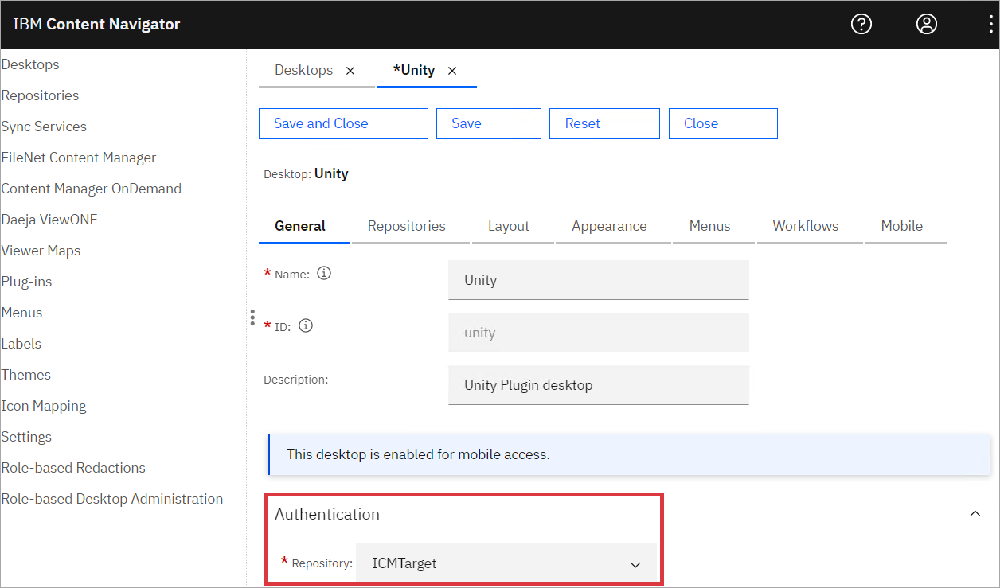

For a discussion of the authentication repository and its effect on Single Sign-On please see the section on SSO.

## (Optional) Copy the JAR file to the ICN Server

The Unity ICN Plug-In is shipped in the form of a JAR file. The JAR file needs to be available to IBM Content Navigator, so it can be invoked.
The JAR file can be located in any directory as long as the ICN installation has access to the JAR file, but the simplest solution is to copy the JAR file to the ICN server in the plugins sub directory.

The JAR file can also be referenced directly from the Unity installation.

The JAR file is located in the VU installation folder. The file system path on the WebSphere server is `[EAR]/[WAR]/resources/icn/vu-icn-plugin-1.0.0.jar`. The `1.0.0` part of the file name is the version number of the Unity ICN Plug-In.
If you are installing a newer version of the Plug-In then the version number might differ.

The HTML URL to the JAR file is `http://[server name]/vu/resources/vu-icn-plugin-1.0.0.jar`. The JAR file can be referenced directly in that location for simple environments.

| **Note**: If you deployed IBM Content Navigator in a highly available cluster environment it is recommended to copy the installed plug-in JAR files to each node in the ICN cluster. In this case the plug-ins must be placed in the plugins sub directory of the IBM Content Navigator installation directory.

The default location on a Windows installation is `C:\Program Files (x86)\IBM\ECMClient\plugins`.

## Register the Plug-In with IBM Content Navigator

The next step is to register the Plug-In with IBM Content Navigator. In order to this you must log into IBM Content Navigator as an administrative user.
Navigate to the `Administration` by clicking the `gear` icon on the left top dropdown toolbar:

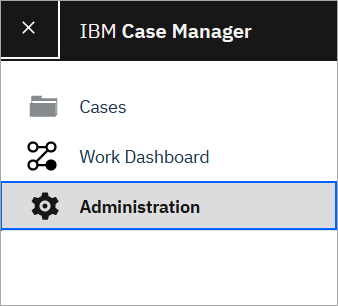

Next click on the Plug-ins icon in the Administrative View:

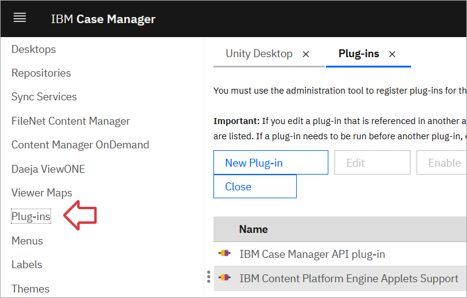

In order to register the Unity ICN Plug-In click the `New Plugin` button as shown below.
Note that the plug-ins that you see in your application below the toolbar will depend on what plug-ins have been installed by your site administrator:

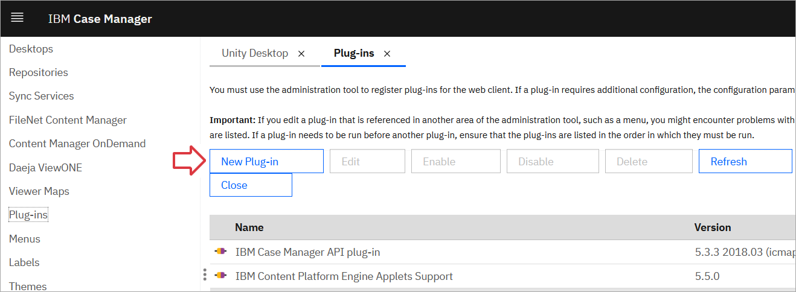

The `New Plug-In` tab appears:

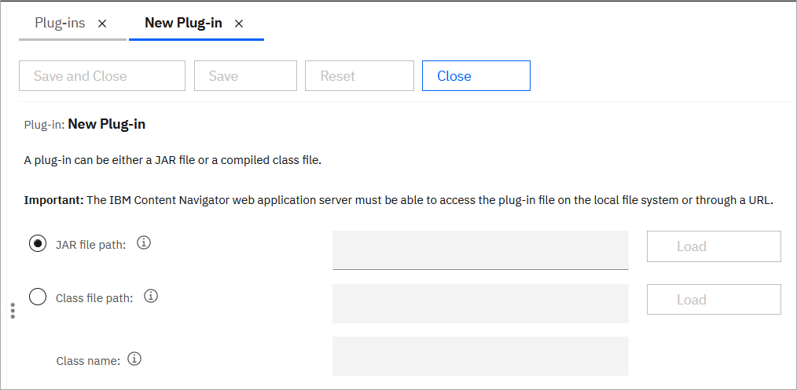

Type in the absolute path for the JAR file that was copied in the previous section.
If you did not copy the JAR file to the ICN server as outlined in section (Optional) Copy the JAR file to the ICN Server, then the HTTP path to the JAR file can be used. In the deployed Unity application, file `http://<host>/<Unity-app>/resources/icn/latest_version.txt` contains the latest version of ICN plugin, i.e.:

```
Latest ICN Unity plugin version: 1.0.5
```

Correspondently, URL to the latest plugin for loading by ICN will be:

```
http://<host>/<Unity-app>/resources/icn/vu-icn-plugin-1.0.5.jar
```

Click the `Load` button to display the JAR information. The properties of the JAR should be as follows. The Version might be different if you are loading a newer version of the Unity ICN Plug-In:

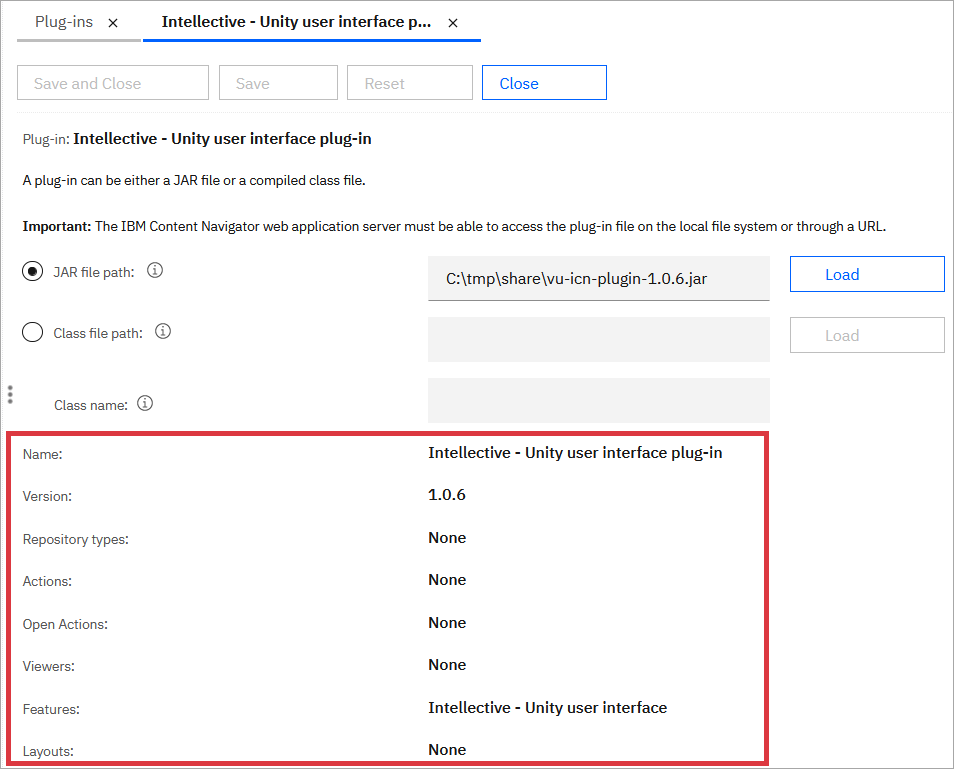

After the JAR has been loaded click the `Save and Close` button to save the Plug-in registration.

If registration is successful, the new Unity user interface plug-in will show up in the available plug-ins for IBM Content Navigator:

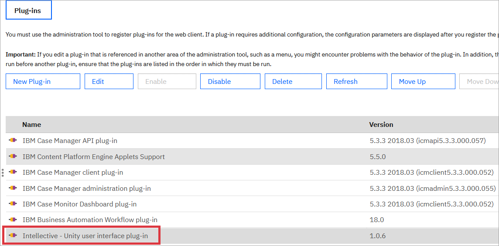

## Configuration of the Plug-In

When the Unity ICN Plug-In has been registered in ICN by following the directions in the section Register the Plug-In with IBM Content Navigator the Plug-In can be configured.

Log into IBM Content Navigator as an administrative user and open the desktop configuration for the desktop that should include the Unity ICN Plug-In.
Once the desktop configuration is shown click the checkbox next to the `Intellective - Unity user interface` as shown below:

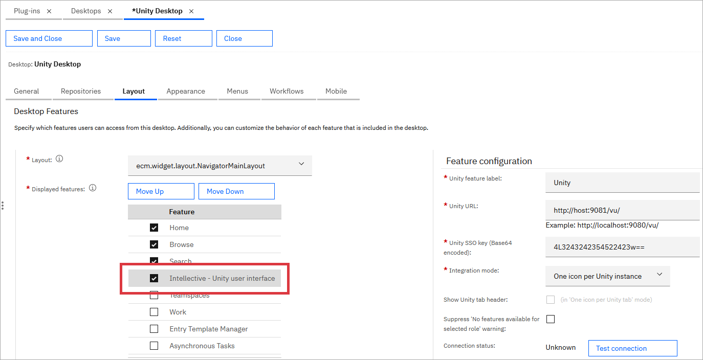

When the Plug-In is selected the `Feature Configuration` is displayed to the right as shown in the screen shot above.

The fields that should be configured are:
- Unity feature label: This description is used as `tooltip` on the Integration Mode `One icon per Unity instance`. It is not used for any other integration mode.
- Unity URL: This is the fully qualified base URL to Unity. The URL can be either HTTP or HTTPS.
- Unity SSO key: This is the generated SSO key. See Single Sign-On Configuration (SSO) - Generate a Unique SSO Key
- Integration Mode: This is the Integration Mode for Unity in the Plug-In mode. The possible modes are:
    - One icon per Unity instance - This mode displays one ICN feature icon per Unity instance.
    - One icon per Unity solution - This mode displays one ICN feature icon per Unity solution.
    - One icon per Unity tab - This mode displays one ICN feature icon per Unity tab in all solutions.
- Show Unity tab header: Display tab header in the Unity frame. This setting is grayed out if Integration Mode is not set to One icon per Unity tab.
- Suppress 'No features available for selected role' warning: click this checkbox to disable the message box with warning `No features available for selected role when ICN desktop with Unity plugin is opened by user which is not assigned to any Unity roles allowed to access tabs.`
    This message may be useful for administrator to discover misconfiguration or lack of access, but in the same time might be annoying for ordinary users who intentionally has no access to Unity.
- `Test connection` button: When the button is clicked the Unity URL and SSO key are verified. Any errors will be displayed to the administrator.

Note that there is no security configuration per Unity solution/tab. This is because at runtime the Unity ICN Plug-In evaluates current users’ credentials against the Unity XML configuration and automatically displays applicable solutions/tabs to the user.
This provides unified and consistent security between native Unity and the Unity ICN Plug-In.
Initially the connection status will have a value of `Unknown` as shown below. The connection status will also be reset to `Unknown` if any changes are made to the Unity URL or SSO Key:

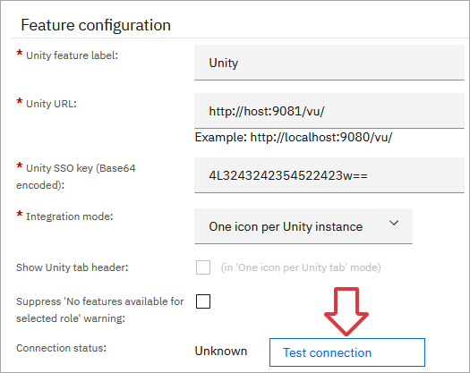

When the administrator clicks the `Test connection` button the Unity URL and SSO Key are verified. If the connection verifies with no errors the connection status changes to `Success`:


If there are any errors during connection validation the error is displayed in an error dialog as seen below. In this example the URL is incorrect:


After the connection error dialog is dismissed the connection status is updated to `Failure`:


If there is an error in the SSO key then a 500 error will typically be displayed:


The Unity ICN Plug-In configuration can be repeated for any ICN desktop that the Unity ICN Plug-In should be shown on.

## (Optional) Change the Layout of the ICN Desktop

The layout can be changed by selecting a different Dojo layout class. IBM Content Navigator ships with a default layout, but custom layouts can be created using standard Dojo layout techniques. The administrator can create custom layouts as needed.

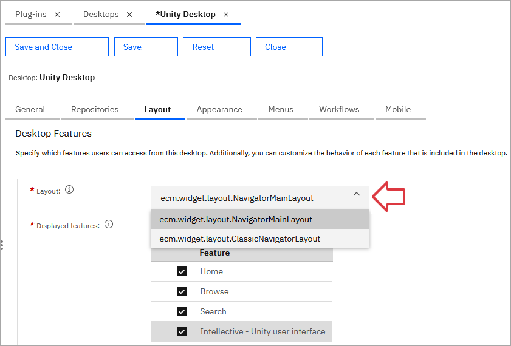

Instructions on how to create a new layout class is described in the [IBM Content Navigator documentation](http://www-01.ibm.com/support/knowledgecenter/SSEUEX_2.0.3/com.ibm.developingeuc.doc/eucso005.htm).

# Support Daeja from ICN Package

The existing Unity - Daeja viewer integration mechanism can be used as is.
The following links describe the steps required to expose the IBM Daeja ViewONE Virtual viewer at IBM Navigator side:
- [Configuring the Viewer Servlet](https://www.ibm.com/support/knowledgecenter/SSTPHR_4.1.5/com.ibm.viewone.install/dvoin006.htm)
- [Installing, Configuring, and Using IBM Daeja ViewOne](https://render-prd-trops.events.ibm.com/support/pages/sites/default/files/support/swg/swgdocs.nsf/0/7f14f1f4d7e09e8885257df600621486/%24FILE/GC27-8105-01.pdf), page 4

[This Unity instance](https://unity-trn-rb.intellectivelab.com:9443/navigator/?desktop=cdm) has been updated this way.

The Unity plug-in's `View` action now invokes the ICN built-in Daeja viewer for documents display.

For example the following update of `navigator.ear\deployments\navigator\navigator.war\WEB-INF\web.xml` has enabled the Daeja viewer for [Unity instance](https://unity-trn-rb.intellectivelab.com:9443/navigator/?desktop=cdm):

```xml
<servlet>
		<servlet-name>viewone</servlet-name>
		<servlet-class>com.ibm.dv.server.Platform</servlet-class>
	</servlet>
	<servlet-mapping>
		<servlet-name>viewone</servlet-name>
		<url-pattern>/v1files/*</url-pattern>
	</servlet-mapping>
```

Below is the `unity-daeja.jsp` file (all `System.out.println(...)` lines should be removed at the non-development environments).

Please note the `src="v1files/viewone.js"` value

```xml
<%@page
        import="com.vegaecm.vu.viewerone.*"
        autoFlush="true"
        errorPage="error.jsp"
%>
<%
    // the contentURL variable shall direct to Vega Unity application
    // specify here actual location of Vega Unity application
    String contentURL = "https://unity-trn-rb.intellectivelab.com:9443/vu-770RC3/DaejaGetContent";
%>
<!DOCTYPE HTML PUBLIC "-//W3C//DTD HTML 4.01 Transitional//EN" "http://www.w3.org/TR/html4/loose.dtd">
<!DOCTYPE html>
<HTML>
<head>
    <script type="text/javascript"
            src="v1files/viewone.js"></script>
    <style>
        html, body{
            height: 100%;
            min-height: 100%;
            margin: 0px;
        }

        #viewone {
            border-width: 0px;
        }
    </style>
</head>
<BODY>
<OBJECT CLASS="com.ibm.dv.client.Viewer"
        ID="viewone"
        WIDTH="100%"
        HEIGHT="100%">
    <%

        String[] vuRequests = request.getParameterValues("vuRequests");
        int docN = 1;
        for (String vuRequest : vuRequests) {
    %>
	<!--<PARAM name="annotate" value="true">
	<PARAM name="annotateEdit" value="true">-->
    <PARAM NAME="doc<%=docN++%>" value="<%=contentURL%>?daeja.action=docdata&<%=vuRequest%>"/>
    <%

        }
		System.out.println("[unity-daeja.jsp] END ");
    %>
</OBJECT>
</BODY>
</HTML>
```

# (Optional) Configure Custom Icons for Plug-In Features

The Unity ICN Plug-In ships with a standard icon for the IBM Content Navigator feature icons displayed in the left feature icon toolbar.
If needed the administrator can configure custom icons instead of the standard feature icons that ship with Unity ICN Plug-In.

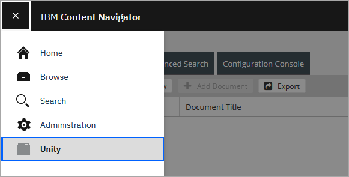

Custom icons can be used for any integration mode. See Unity ICN Plug-In Configuration for an explanation of integration modes.

In order to use custom icons, they should be created, deployed and configured.

## Create Custom Icons

Custom icons can be created with any graphic editing software. The custom icons must however have the following specifications.

- Type: png or svg images
- Size: 32 x 32 px

The sprite should contain both `not activated` and `activated` images - with `not activated` with position 0px 0px and `activated` with position 0px 32px. Therefore, the vertical size of the sprite is 64 px.

Example of the sprite:


The standard icons that ship with are the same for Instance, Solution and Tabs:

- Not-activated:

    

- Activated:

    

It is recommended to create simplified grey/blue custom icons in line with the icons above to stay with the visual style of the OOTB IBM Content Navigator icons.

## Deploy Custom Icons

Once the custom icons have been created, they need to be deployed to the application.

The icons can be located on any accessible WebSphere server, but typically they are either located on the IBM Content Navigator or Unity web server.

| **Note**: If you deployed IBM Content Navigator in a highly available cluster environment it is recommended to copy the custom icon files to each node in the ICN cluster.

If icons are stored on the Unity web server, then the recommended path to put custom icons in VU build is: `[EAR]/[WAR]/custom/resources/images/`.

For example: `[EAR]/[WAR]/custom/resources/images/customTab.png`, for this file `custom/resources/images/customTab.png` should be specified in configuration file for tab to have custom icon for ICN feature.
This will be described in the following section.

## Configure Custom Icons

When the custom icons have been deployed the next step is to configure the custom icons in the application.

The custom icons are configured in the Unity XML Configuration file as explained in the following.

It is possible to configure custom icons for the Unity Instance, Solution(s) and Tab(s). The configuration for each of those vary a little, but the general concept is the same.
The custom icon URL is configured in the Unity XML configuration file(s).

- In order to configure a custom icon for the Unity instance add an icon attribute to the `VegaUnitySolutions` tag as shown below.

    **Unity Configuration XML File - Instance Icon**

    ```xml
    <Configuration>
     ...
     <VegaUnitySolutions icon="custom/resources/images/customUnityIcon.png">
      <VegaUnitySolution ID="solution1" name="Solution Name" file="E:\vspace\vspace-one.xml" />
     </VegaUnitySolutions>
     ...
    </Configuration>
    ```

- In order to configure a custom icon for a Unity solution add an icon attribute to the `VegaUnitySolution` tag as shown below. Each solution can have a unique icon.

    **Unity Configuration XML File - Solution Icon**

    ```xml
    <Configuration>
     ...
     <VegaUnitySolutions>
      <VegaUnitySolution ID="solution1" name="Solution Name" file="/opt/unity/solutionConfig1.xml" icon="custom/resources/images/customSolutionIcon.png">
      ...
      </VegaUnitySolution>
     </VegaUnitySolutions>
     ...
    </Configuration>
    ```

- In order to configure a custom icon for a Unity tab add an icon attribute to the `Tab` tag as shown in line six below. Each solution can have a unique icon.

    **Unity Configuration XML File - Tab Icon**

    ```xml
    <Configuration>
     ...
     <Tabs>
      <Tab ID="folder-view" icon="custom/resources/images/customTabIcon.svg">
       <Title>Folder View</Title>
       <XType>folder-view-tab</XType>
       ...
      </Tab>
     </Tabs>
     ...
    </Configuration>
    ```

When the icon configuration has been completed in the Unity XML Configuration file, the Unity application should be restarted in order for the configuration to take effect.

## WebSphere MIME Type Configuration

If the custom icons that are being deployed are SVG files, then WebSphere must be configured to service SVG files.

Verify that WebSphere has been configured to serve SVG files correctly. If this has not been set up already in your IBM Content Navigator WebSphere instance this has to be set up.

- Open the WebSphere administration console. The default URL is `https://[server name]:9043/ibm/console`.
- Navigate to `Environment > Virtual Hosts > default_host > MIME Types`:

   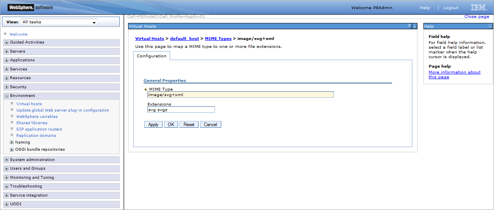

- Verify that the MIME type shown above is configured. If not, then click the `New...` button and add the new MIME type association.
    Note that on some server platforms the extensions are case sensitive, so it is a good practice to add the extensions in both lower and upper case.

# Unity ICN Plug-In Usage

This section describes the end user experience for the Unity ICN Plug-In. It is not intended as an end user documentation of the functionality, as it makes references to the administrative setup of the Plug-In.

## IBM Content Navigator Authentication

When the end user initially accesses IBM Content Navigator the user will be authenticated. The screen shot below shows the standard IBM Content Navigator login screen:


Once the user has been authenticated the main IBM Content navigator screen shown. This section will concentrate on the Unity Plug-In elements and generic IBM Content Navigator UI components will not be described.


There are three areas of the screen. They are shown and marked with numbers in the screen shot above.
1.	Unity Role Selector
2.	Unity Main User Interface
3.	IBM Content Navigator Feature Icons

These three areas of the screen are described in the following sections.

The layout of the ICN regions can be changed by [modifying the ICN layout](#optional-change-the-layout-of-the-icn-desktop).

## Unity Role Selector

The Unity Role selector displays all the Unity roles that are available for the current user.
The user can select any available role:


 
When a different role is selected the Unity user interface will refresh displaying data for the new role.
This is default behavior for Unity. This will clear any data currently displayed in Unity will be cleared. Therefore, the Unity ICN Plug-In will display a confirmation dialog before the role is changed.

The confirmation dialog is shown below.
If the user answers `Yes` then the Unity UI will be reloaded.


If the browser is refreshed because the user hits `F5` or `Refresh` in the browser, the Role selection will be retained.
It is important to note though that object edits that had not been saved prior to the browser refresh will not be saved.

### Hiding Role Selector

There is `role.mode` system property in Unity Config XML that controls visibility of the Role Selector. If `role.mode` is set to `RoleUnion` value, the Role Selector will be hidden.

```xml
<SystemProperties>
   ...
   <Property ID="role.mode" value="RoleUnion"/>
   ...
</SystemProperties>
```

To show it set `role.mode` to `RoleSelection`.

```xml
<SystemProperties>
   ...
   <Property ID="role.mode" value="RoleSelection"/>
   ...
</SystemProperties>
```

## Unity Main User Interface

The Unity main user interface is displayed in the center region.
The contents of the user interface depend on the IBM Content Navigator feature icon that is clicked and the Unity configuration corresponding to the feature icon.

## IBM Content Navigator Feature Icons

The Unity ICN Plug-In displays at runtime dynamically the appropriate feature icons to the user. The number and functionality of the Unity ICN Feature Icons depend on the following:

- [Configuration of the Unity ICN Plug-In](#configuration-of-the-plug-in)
- Current user credentials – only features that the user is authorized to see will be shown
- Current role selected in the [Unity ICN Plug-In role selector](#unity-role-selector)
- Unity configuration that is stored in one or more Unity Configuration XML Files

When the user clicks on an ICN Feature Icon that is related to Unity the main panel containing the Unity user interface for that Feature Icon is loaded.
All loaded Unity features will stay resident in memory during the ICN session.

This means that the user can click on Feature Icon "A" type in some values, then click on Feature Icon "B" and do some work.
When the user then later clicks back to Feature Icon "A" in the same session the values that were typed in will have been retained as the feature was kept in memory.
This allows the user to have very flexible interactions with IBM Content Navigator/Unity.
One typical business scenario is that the user is working on something, receives a call that needs to be handled by another feature.
After the call is completed the user can go back to the work that was in process before.

## Software Compatibility/Requirements

The Unity ICN Plug-In is shipped with Unity.

IBM Content Navigator version 3.0.3 or higher is required for the Plug-In.

The Plug-In is supported on any version of IBM WebSphere that is supported by IBM Content Navigator 3.0.3 or higher.

The Plug-in is supported on any browser that is supported by IBM Content Navigator 3.0.3 or higher.

The Plug-in is supported on any operating system (both client and server) that is supported by IBM Content Navigator 3.0.3 or higher.

Java version 1.7 or higher is required for this Plug-in.

# Known Issues

[Known Issues](unity-for-icn/known-issues.md)