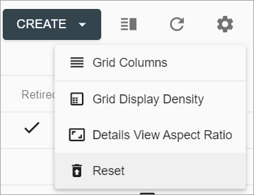

Normally grid columns width is set automatically in order to fill whole grid horizontal space. The columns may be resized by mouse by dragging column separators. To show the separators, move mouse over the column heading and left and right side separators will be shown. Hold a separator with mouse and move horizontally to resize the column:  

 

Last column width may not be changed. If grid occupies whole container form width, the last column takes all the remaining width till the right side of the grid. However, if grid is wider than its container, the last column width is set automatically by actual content.

The minimum size of the columns is determined by column header, the actual column data in the grid rows may be shortened when shown in too narrow columns.

Width of a column becomes fixed once it was resized. Other columns width remains automatically maintained. To reset the columns width to default (and revert the visible state of the columns and their order) use `Reset` command from grid menu: 

 

Per each grid, changed columns width is saved into browser storage and restored on next session. Width units are pixels, so if in next session the grid will be shown in narrower window or in smaller screen resolution, horizontal scrollbars may appear. 

Auxiliary columns, such as leftmost checkbox column and action menu (ellipsis) column, are not resizable: 

 

The column resizing feature is not configurable.
