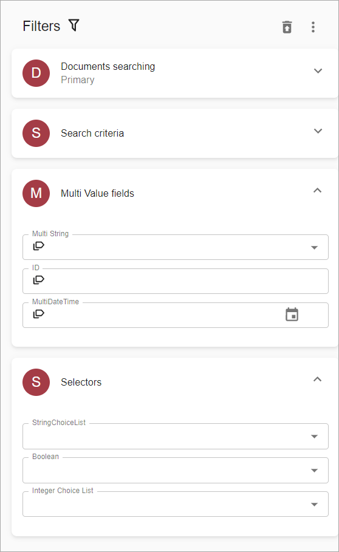

[Search Template Component description](../components/search-template.md)

*content to be added*
 
# Operation Section Configuration

## Documents/Cases/Workitems search

Set of properties inside `Operation` -> `OperationProperties` section depends on data provider and type of resource. 

[FileNet (CERepositoryDataProvider)](search-templates/filenet.md)  
[CMIS (CMISRepositoryDataProvider)](search-templates/cmis.md)  
[Box (BoxRepositoryDataProvider)](search-templates/box.md)  
[CMOD (CmodRepositoryDataProvider)](search-templates/cmod.md)  
[CM8 (Cm8RepositoryDataProvider)](search-templates/cm8.md)  
[Enterprise search](search-templates/enterprise-search.md)  
[DB (DBRepositoryDataProvider)](search-templates/db.md)  
[SharePoint](search-templates/sharepoint.md)  
[LDAP (LdapProvider)](search-templates/ldap.md)  

## Search templates for view action tabs

[Document versions](search-templates/document-versions.md)  
[Case attachments](search-templates/case-attachments.md)

# Criteria Section Configuration

Criteria section can contain a set of `Criterion`s to be used for rendering criteria search panel.

*content to be added*

# Quick Search Criteria

| Parameter | Value|
|:----------|:-----|
|`QuickSearch` |`[true|false]` |

Set `true` to use criterion in the quick search. If it's not specified, the default value is `false`.

Example:

```xml
<SearchTemplate ID="document_Search_Documents">
    <Criteria>
        <Criterion>
            <FieldName>DocumentTitle</FieldName>
            <Type>string</Type>
            <Operator>starts</Operator>
            <Required>false</Required>
            <Hidden>false</Hidden>
            <Readonly>false</Readonly>
            <MultiValue>false</MultiValue>
            <QuickSearch>true</QuickSearch>
        </Criterion>
    </Criteria>
</SearchTemplate>
```

# Grouping Criteria

*content to be added*

| Parameter | Description| Value|
|:----------|:-----------|:-----|
|`Group/@ID`| | |
|`Group/@Title`| | |
|`Group/@Expanded` | allows to [show group expanded or collapsed](search-templates.md#expandcollapse-criteria-groups-by-default) by default | `[true|false]` |

## Expand/Collapse criteria groups by default

Groups of criteria can be shown collapsed or expanded by default.

| Parameter | Value|
|:----------|:-----|
|`Group/@Expanded` |`[true|false]` |

Set `true` to show criteria group expanded, `false` to show criteria group collapsed. If it's not specified, the default value is `true`.

Example:

```xml
<SearchTemplate ID="document_Search_Documents">
    <Groups>
        <Group ID="criteriagroup" Title="Search criteria" Expanded="false"/>
        <Group ID="multiValue" Title="Multi Value fields"/>
        <Group ID="selectors" Title="Selectors" Expanded="true"/>
        <Group ID="document_Search_Documents" Title="Documents searching" Expanded="false"/>
    </Groups>
</SearchTemplate>
```
It will look in application:



## Category criteria 

[Facet (category) field](search-templates/facet-category-field.md)

# Sorting Configuration
```xml
<SearchTemplate ID="templateByDate">
    <SortFields>
        <SortField Order="DESC">$modify_date</SortField>
        <SortField Order="ASC">$title</SortField>
    </SortFields>
    <!-- not relevant nodes skipped -->
</SearchTemplate>
```

| Parameter           | Description |
|:--------------------|:------------|
| `SortField`           | `SortField` value refers to a [Property](tags-list/properties-tag.md) `ID` attribute (the property should be sortable).  Default sorting may be defined on the [Grid](../configuration/grids/multiple-column-sorting.md) level or on the `SearchTemplate` level. If defined on both levels, setting from the `Grid` is in effect.     |
| `SortField/@Order`  | Optional `Order` attribute may have value `ASC` for ascending and `DESC` for descending order (`ASC` is a default). |

