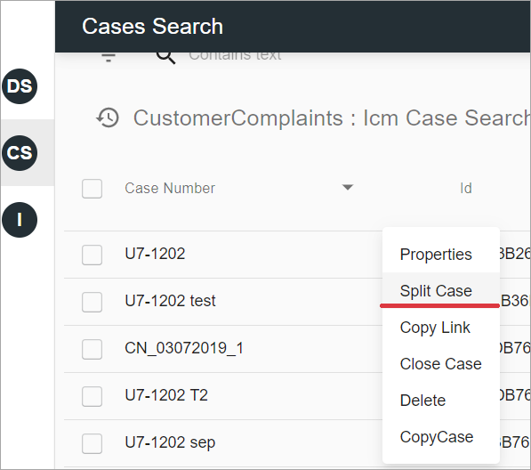
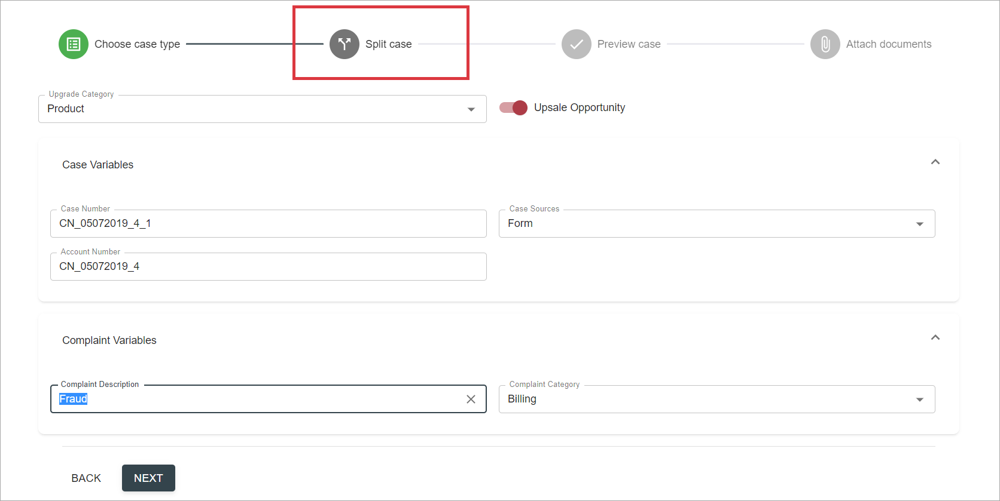
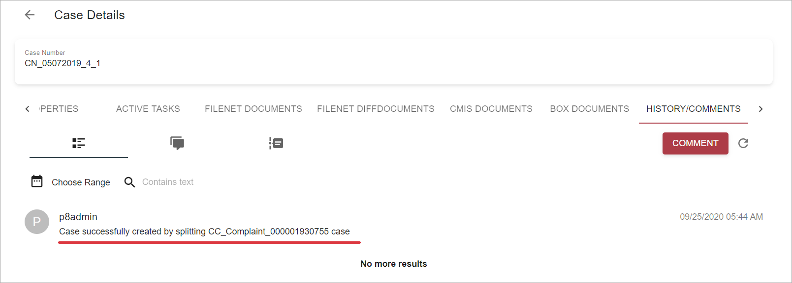

# Description

`Split case` action allows creating a case that reuses data from an existing case. The new case can be the same type as the original case, or it can be a different case type.

Unity supports IBM Case Manager Split Case feature via Unity ICM over UCM Data Provider.

# How to Split a Case

`Split case` in React UI is implemented as a grid action available for Cases resources via a grid's context menu:

 

Once selected, the action will be executed as a wizard with several steps:

- The first step is Choose Case Type form where selected case is opened for a preview. 
If more than one target case types are available from the [configuration](../../configuration/actions/split-case.md), the list of target case types will be shown:

              

- Next step is a Split Case screen. It contains data from selected case in editable form where users can update values if needed or leave original data:

    

    By selecting Next button in this screen, user actually triggers Case Split action execution in a backend system (i.e. IBM ICM).

- Upon successful completion the wizard opens next step Preview Case with a preview form.

- Forth optional step is a screen where user is able to choose documents from source case and, by selecting 'Attach' button, link these documents with target case as well.

As a result new case will be created on top of existing case. Relevant information will be tracked in the history of the case:

# Configuration

[React UI Case split action configuration](../../configuration/actions/split-case.md)
