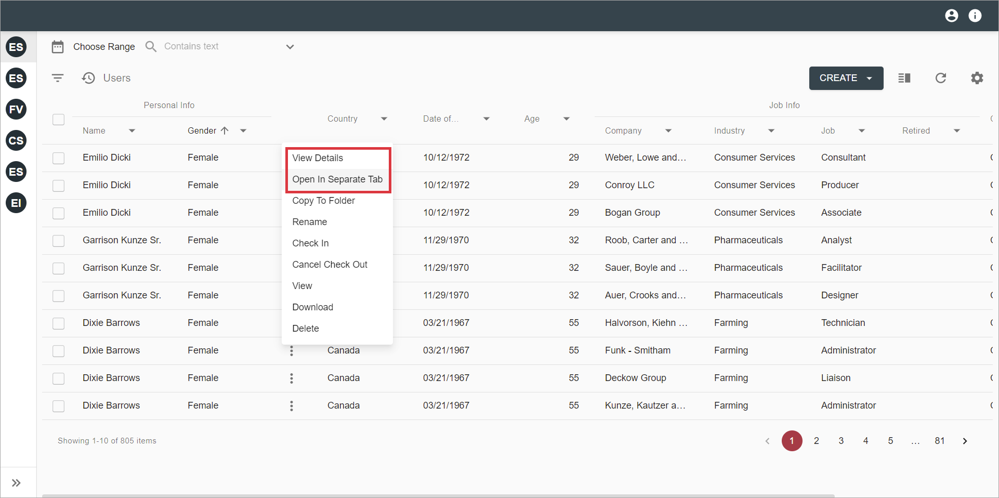
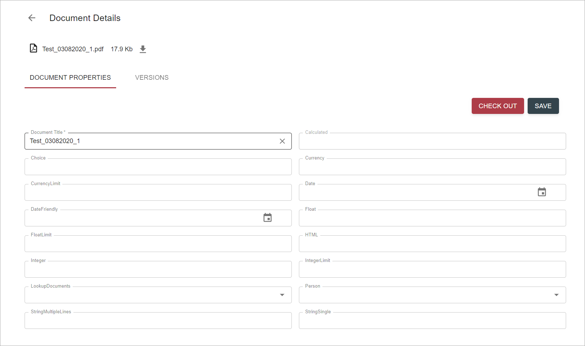

# Description

`Document details` feature allows to: 

- view and edit document properties

- view versions

- perform some actions on document like `check out`, `check in`, `cancel check out`, `view content`, `download`, `delete`, 
`open in office`, etc. List of document actions depends on action view configuration and data provider

- perform some actions on document versions like `promote`, `demote`, `make version current`, `delete version`. List of 
actions depends on configuration and data provider

# How to Use Document Details

To open Document Details from the grid:

- Click on Document Title
- Or open actions menu by clicking on the vertical ellipse icon consisting of three dots in the grid row and select `View Details` action from dropdown list
- Or open actions menu and select `Open in Separate Tab` action from dropdown list to open Document Details in separate browser tab:

    

`Document Details` view will be opened:                            

   
    
|**Note:** When clicking on Document Title, [Default Action](https://docs.intellectivelab.com/docs/unity-react/components/grid/default-action/) is performed. It can be configured to perform another action.  

`Document Properties` tab is shown by default. This tab displays metadata, which can be modified by an authorized user. 

User can switch to `Versions` tab. The Version History tab displays information on each version of the file. Each time the file is modified, the version capable repositories create a new version of the file to track the changes made. 
From this tab, you can see and interact with the current version of the document, as well as all prior versions.

Edit available fields and save changes by clicking `Save` button.

# Configuration

[Document details action configuration](../../configuration/actions/document-details.md)  
[Open in separate tab action configuration](../../configuration/actions/open-in-separate-tab.md)  
