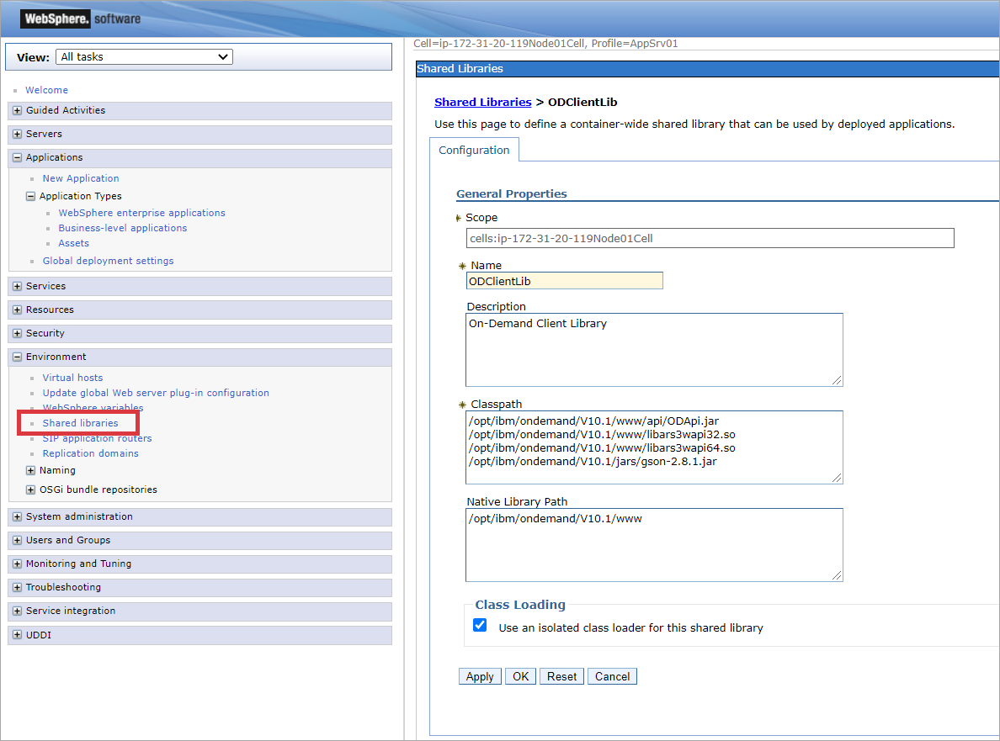
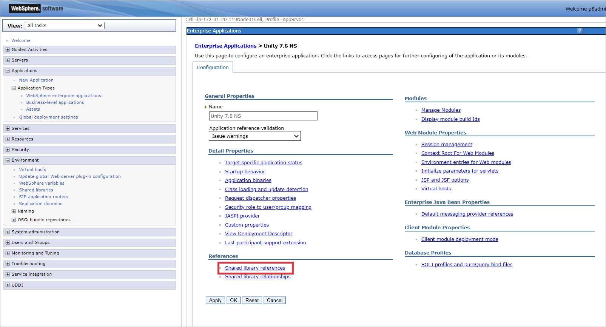
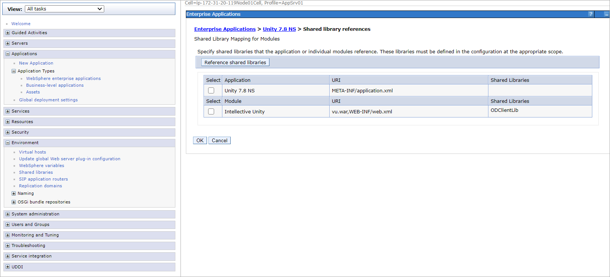
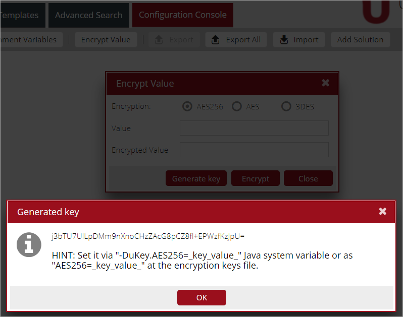

|**Note**: Unity Installation is the same for Unity ExtJS and Unity React.

*content to be added*

# WAS9 additional configuration for working with CMOD
1. Open WAS9 administrative console
2. Select Environment >> Shared libraries section
3. Select scrope and press New button
4. Add full path to the Classpath section for the following files
   - ODApi.jar
   - libars3wapi32.so
   - libars3wapi64.so
   - gson-2.8.1.jar
   use appropriate files for Windows instead of libars3wapi32.so and libars3wapi64.so
5. Add full path for ondemand files to the Native Library Path section
6. Check "Use an isolated class loader for this shared library" in the Class loading Section
 
7. Press Apply
8. Restart WAS9

Created Shared Library should be used in the installed Unity application
1. Open WAS9 administrative console
2. Select Applications >> Application Type >> WebSphere enterprise applications
3. Click on Unity application
4. Click on Shared library references link
 
5. Select Intellective Unity module
6. Press Reference shared libraries button
7. Selected created Shared Library with CMOD files
 
8. Press OK button
9. Press OK on Shared library references window
 
10. Click on Save link
 
11. Restart Unity application


# Unity Master Key Configuration

## Master key

The application wide Unity master key is used to encrypt/decrypt arbitrary values at Unity configuration file.  
This key is defined either at application's web.xml file or via java runtime property (-Dkey=value) for the whole application server  
where Unity is deployed.

Before actual usage, the Unity master key should be configured to enable values encryption at the Unity configuration files.

The Unity master key can be generated either before Unity deployment via command line utility or when Unity already deployed and running via 
Unity Configuration Console UI.

## Generate master key with command line utility

- Extract Unity distribution ZIP package into some temporary directory and go to the `VegaUnity/bin` folder.  
- Use either `encryptionSupport.cmd` (on Windows) or `encryptionSupport.sh` (on Linux) to generate the Unity master key.  
    This is a general purpose utility, so the following command line arguments should be used to execute actual key generation:

    ```
    -generateKey -alphanum -cipher AES256
    ```
 
    - `-generateKey` argument selects the actual operation to be executed
    - `-alphanum` argument forces the utility to generate key with only alphanumeric characters
    - `-cipher AES256` argument specifies the cipher type (supported values: 3DES, AES256, AES)

For example:  
```
C:\tmp\Unity_7.7.2\VegaUnity\bin>encryptionSupport.cmd -generateKey -alphanum -cipher AES256
---------------------------------------------------------
| Encryption type: AES256
---------------------------------------------------------
ZjJwRjFHZ04yM091bUJrb0t3amFHUTViNkVqU280RE0=
```

## Generate master key with Unity Configuration Console UI

The master key can be generated through the dedicated UI dialog at Unity Configuration Console. 
 
- Login to the Unity with the user with the rights to access the Configuration Console tab.  
- Go to the Configuration Console tab and locate the `Encrypt value` button at the main toolbar at the right.  
- Press that button and the `Encrypt Value` dialog will appear.  
- Select the encryption type using `Encryption` radio control and then press the `Generate key` button at the bottom of this dialog.  

The generated master key will be displayed at the new `Generated key` popup window:

 


## Use generated master key for Unity instance deployment

### Master key at application's web.xml file

In this case, the master key is specified at application's `web.xml` file in the same way as the location of main Unity configuration  
file (`vSpaceConfigURL` one).  
The following env entry names can be used for that purpose (each next item at the list can be used to override key from the item before):  

- `encryptionKeysFile`. This value points to the location of encryption keys file. See the file format description below.
- `vuKey` (pre Unity 7.7.2 approach). This is exact value of AES256 encryption key.

For example:
```xml
<?xml version="1.0" encoding="UTF-8"?>
<web-app id="VegaUnity" version="2.4" xmlns="http://java.sun.com/xml/ns/j2ee"
         xmlns:xsi="http://www.w3.org/2001/XMLSchema-instance"
         xsi:schemaLocation="http://java.sun.com/xml/ns/j2ee http://java.sun.com/xml/ns/j2ee/web-app_2_4.xsd">

...
    <env-entry>
        <env-entry-name>encryptionKeysFile</env-entry-name>
        <env-entry-type>java.lang.String</env-entry-type>
        <env-entry-value>C:/wlp/usr/servers/Vu7/keys/unity_master_keys.txt</env-entry-value>
    </env-entry>
...

</web-app>
```

or

```xml
<?xml version="1.0" encoding="UTF-8"?>
<web-app id="VegaUnity" version="2.4" xmlns="http://java.sun.com/xml/ns/j2ee"
         xmlns:xsi="http://www.w3.org/2001/XMLSchema-instance"
         xsi:schemaLocation="http://java.sun.com/xml/ns/j2ee http://java.sun.com/xml/ns/j2ee/web-app_2_4.xsd">

...
    <env-entry>
        <env-entry-name>vuKey</env-entry-name>
        <env-entry-type>java.lang.String</env-entry-type>
        <env-entry-value>ZjJwRjFHZ04yM091bUJrb0t3amFHUTViNkVqU280RE0=</env-entry-value>
    </env-entry>
...

</web-app>
```

The encryption keys file is the plain text file that contains the list of master keys for each supported encryption algorithms (3DES, AES and AES256).  
For example:

```text
3DES=s1f449/mMbbLi423f78LmFTltQRPx83x
AES=ZGVmYXVsdCBhZXMxMjgga2V5LCBwbGVhc2U4643wbGFjZSBpbiBwcm9kdWN0aW9u
AES256=ZjJwRjFHZ04yM091bUJrb0t3amFHUTViNkVqU280RE0=
```

### Master key at java runtime properties

In this case, the master key is specified via java runtime property (-Dkey=value) for the whole application server.  
The following java runtime properties can be used for that purpose (each next item at the list can be used to override key from the item before):  

* `encryptionKeysFile` (-DencryptionKeysFile=_file_path_). This value points to the location of encryption keys file. See the file format description above.
* `uKey.AES256` (-DuKey.AES256=_key_value_). This is exact value of AES256 encryption key.
* `uKey.3DES` (-DuKey.3DES=_key_value_). This is exact value of 3DES encryption key.
* `uKey.AES` (-DuKey.AES=_key_value_). This is exact value of AES (AES with 128 bits key) encryption key.
* `uKey` (-DuKey=_key_value_). This is alias for `uKey.AES256` java runtime property.

