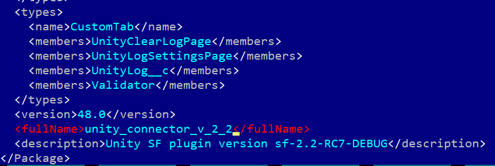
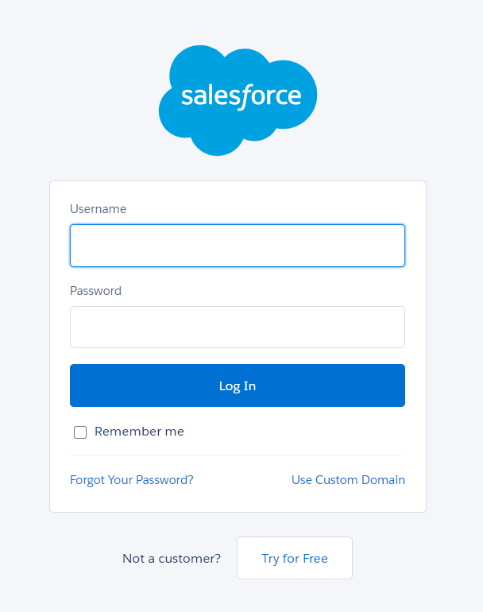
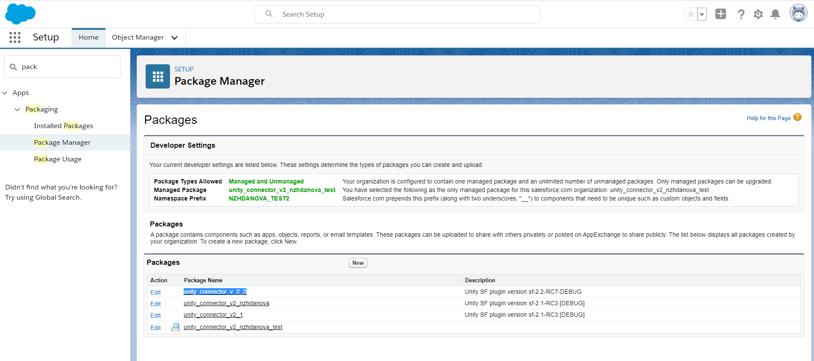
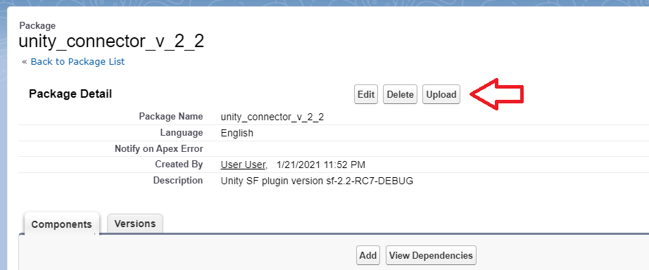

# Create managed Salesforce package

## Prerequisites

- A new Salesforce account should exist or has to be created for managed package
- Salesforce CLI should be installed in order to deploy a package to Salesforce Org

## Deploy a package

- Download package using WinSCP or other tools from 192.168.110.17 
(/var/nfs2/samba/products/salesforce/qa/sf-{PACKAGE-VERSION}):

    

	| Package name       | Terms of use          |
	|:-------------------|:------------------------------------------|
	| update.debug.zip   | Debug version of package with additional debug capabilities. For internal use only. Should be used when upgrading previously installed debug version |
	| install.debug.zip  | Debug version of package with additional debug capabilities. For internal use only. Should be used for initial installation |
	| update.default.zip | Default version of package created for QA testing. Should be used when upgrading previously installed debug version |
	| install.default.zip| Default version of package created for QA testing. Should be used for initial installation |
	
- Unzip archive

- Open mdapi_output folder inside unzipped archive in Far Manager

    Package name is unity_connector_v2 by default and can be changed in package.xml file:
    
    
    
    When upgrading use the name of existing package.
    
    When creating new one just leave as is or modify, e.g.:
    
     
     
     Remember this name as it will be used on further steps.

- Remove following folders: authproviders, customMetadata, namedCredentials. 
**Skip this step if you don't need to create a managed package** (i.e. if you only need to deploy package for testing). 

- Open package.xml file once again and remove following sections:

```xml
  <types>
    <name>AuthProvider</name>
    <members>UnityOAuth2Provider</members>
  </types>
``` 

```xml
  <types>
    <name>NamedCredential</name>
    <members>vu_nc</members>
  </types>
```

```text
  <types>
    <name>CustomMetadata</name>
    <members>UnityOAuth2Setting__mdt.UnityOAuth2Provider</members>
  </types>
```

**Skip this step if you don't need to create a managed package** (i.e. if you only need to deploy package for testing).

- Enter following command from mdapi_output folder:

    ```text
    sfdx force:auth:web:login --setdefaultdevhubusername
    ```

- Salesforce login page will be opened in new browser tab:

    
 
- Enter your credentials and click `Log In`

- Enter following command from **root** archive folder:

    ```text
    sfdx force:mdapi:deploy -d mdapi_output/ -u "nzhdanova@intellective.com" -w 1
    ``` 

    Replace nzhdanova@intellective.com with your username 

- Press Ctrl+O and ensure all components were successfully updated:

    

    Notes: 
    - number of components may be different and depends on package version 
    - MDAPI progress may have a different view, it depends on Salesforce CLI version
    
    It's possible to check job progress by given Job ID, see Salesforce CLI guide for more details on available commands.
    
## Create Managed Package
    
- Open Salesforce Org and find deployed package (Gear icon -> Setup -> Package Manager):

    
    
- Open package from the list and click `Upload` button:

    

- Enter upload details (`Version Name` and `Version Number`), e.g.:

    
    
- Click `Upload` button. Upload process will be started:

    
    
- After process is finished, `Installation URL` will become available:

    

- Wait for about 5-30 minutes before installing it to another Org.