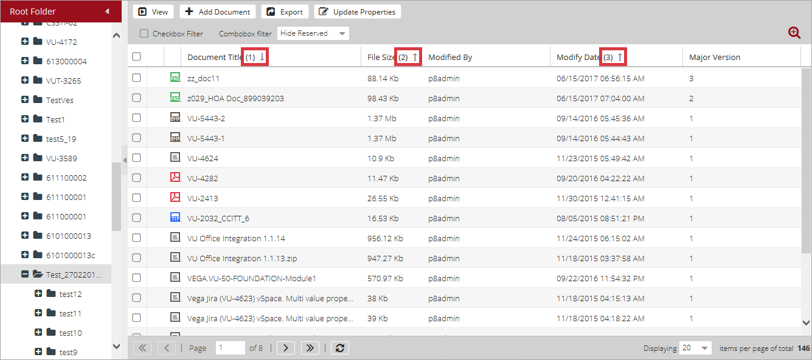

# Grouping  
*Content to be added*

# Multiple Column Sorting

You can configure the default Grid to allow multiple columns to be sorted at a time within the content list.

To use a multiple column sorting grid, click the header of a column. The grid sorts to that column (toggling between ascending or descending), and a number (1) appears next to that header. This number indicates that column is the primary sort column.  

To sort by a second column, click the header for another column. The grid sorts to that column (toggling between ascending or descending) while maintaining the sorting of the primary sort column, and a number (2) appears next to that header. This number indicates the column is the secondary sort column.

Continue until you reach the max number of sort columns (3 by default): 

 

This feature implemented for:

- Tabs: Search Template, Folder View, Advanced Search
- Data Providers: FileNet, CMIS, UIE (except JOIN function) 

[Configure Multiple Column Sorting](../configuration/grids.md)

# Column locking
*Content to be added*

# Column spanning 
*Content to be added*

# Column reordering
*Content to be added*

# Column menu
*Content to be added*

# Column cell formatting 
*Content to be added*

# Column cell tools and actions 
*Content to be added*

# Column cell rendering customization
*Content to be added*

# Record text links
*Content to be added*
 
# Multiple row selection
*Content to be added*
	
# Row action	
*Content to be added*

# Bulk action 
*Content to be added*

# Ability to add a custom grid action 
*Content to be added*

# Row actions menu 
*Content to be added*

# Expandable rows
*Content to be added*

# Pagination
*Content to be added*
	
# Ability to use a custom grid pagination 
*Content to be added*

# Infinite scrolling
*Content to be added*
	
# Data export 
*Content to be added*

# Display density settings
*Content to be added*
 
# Ability to compose with other components 
*Content to be added*

# Adaptive
*Content to be added*

# Responsive
*Content to be added*
	
# Configurable 
*Content to be added*

