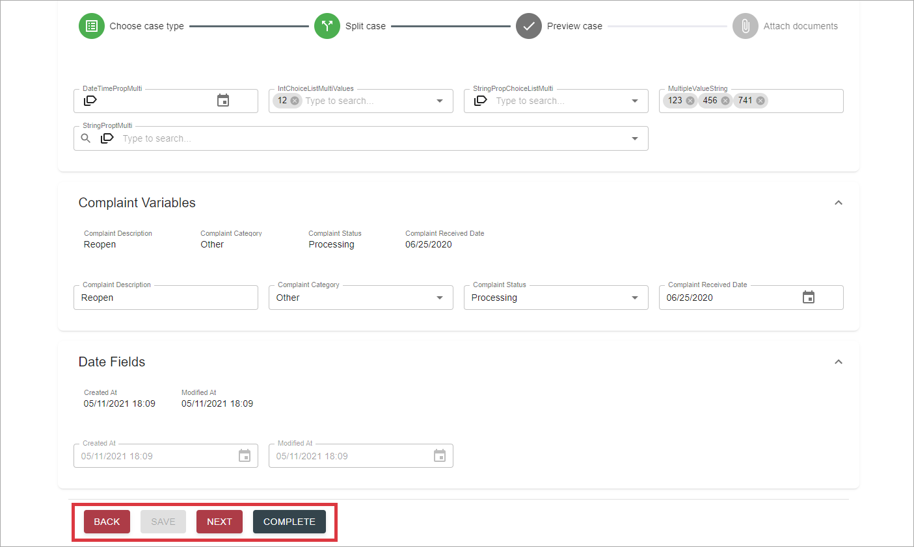

# Description

`Split case` action allows creating a case that reuses data from an existing case. The new case can be the same type as the original case, or it can be a different case type.

Unity supports IBM Case Manager Split Case feature via Unity ICM over UCM Data Provider.

# How to Split a Case

`Split case` action in React UI is implemented as a grid action available for Cases resources via a grid's context menu:

 

Once selected, the action will be executed as a wizard with several steps:

- Step 1. Choose Case Type.

    Properties of selected case are shown for Read-Only preview. 
    If more than one target case types are available from the [configuration](../../configuration/actions/split-case), a dropdown list of target case types will be shown after clicking `Next` button:

        
    
    Choose case type from this list.      

- Step 2. Set case properties on Split Case screen. 

    It contains data from selected case in editable form. Update values if needed or leave original data:

    

    By selecting `Next` button in this screen, user actually triggers `Split case` action execution in a backend system (i.e. IBM ICM).

- Step 3. Preview Case.

    
       
    Click `Complete` button to finish case creation or click `Next` to attach documents to the case.
    
- Step 4 (Optional). Attach documents to target case.

    Choose documents from source case and, by clicking `Attach` button, link these documents with target case as well. Selected documents will be attached to the root folder of target case.
    
    Click `Complete` button to finish case creation.

As a result the new case will be created. Relevant information will be tracked in the history of the case:

# Configuration

[Split case action configuration](../../configuration/actions/split-case)
