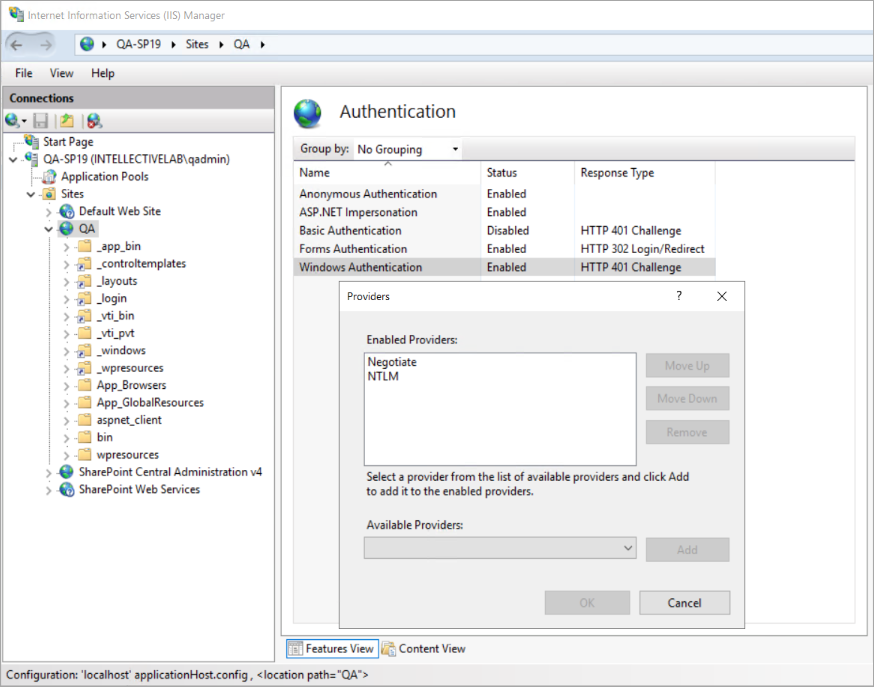
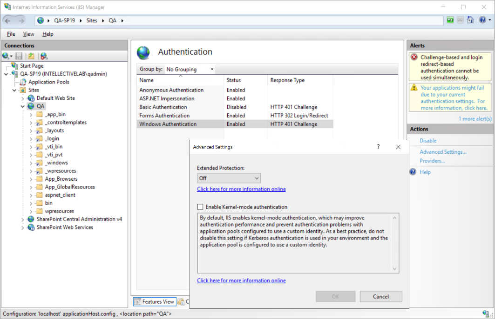
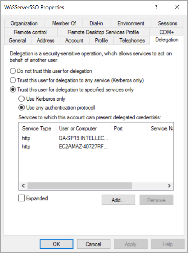

|**Note**: SharePoint Connector Configuration is the same for Unity ExtJS and Unity React.

# Description 
Unity SharePoint connector support SPNEGO delegated credentials authentication to seamless authenticate already authenticated user to SP target.
Following are prerequisites for SPNEGO.    
- SPNEGO authentication must be enabled for SharePoint instance.
- Service account must be configured in Active Directory to delegate to SharePoint SPN. 
- JAAS KRB5 login module must be configured for the container hosting Unity. This module should be set git br

# Unity DataSource configuration
To enable SPNEGO for SP DataSource use configured login module in the configuration:
 
```xml
        <Datasource ID="sharepoint_ds" class="com.vegaecm.vspace.datasources.SharepointDatasource">
            <RootUrl>http://qa-sp19.intellectivelab.com/</RootUrl>
            <Login>qadmin</Login>
            <KrbLoginModule>krbsp</KrbLoginModule>
        </Datasource>
```

Note that no password for admin user and no ApplicationId and AzureDomain defined for Datasource.

# Configure SPNEGO(Kerberos SSO) for SharePoint
## Prerequisites
 - Admin privileges for AD and SP required to configure. 
 - Kerberos authentication requires that your servers have host (A) records created for them in DNS (not CNAME).
 - Kerberos needs the service domain account(s) that you have associated with target SharePoint Web applications as well as your back-end SQL Servers.

## Setup
- Go to SharePoint Central Administration: 

    
 
- Navigate to `Application Management > Manage web applications`.  
    Select your target Web application and then clicking `Authentication Providers`.  
    In the Authentication Providers dialog click authentication zone.  
    In `Edit Authentication` dialog box check for `Claims Authentication Types`: `Enabled Windows Authentication > Integrated Windows Authentication > Negotiate(Kerberos)`:  
 
    

- Check or create SPNs for SharePoint servers and mssql servers. 
    Use `setspn -Q` commands to verify SPN are linked to proper service accounts:

    ```console
    setspn -Q MSSQLSvc/* 
    setspn -Q HTTP/*
    ```
    Use `setspn -S` to create proper SPN if missing: 
 
    ```console
    setspn -S HTTP/qa-sp19.intellectivelab.com INTELLECTIVELAB\devopsadmin 
    ```

- Check Authentication `Negotiate` above `NTLM`: 

    

    and advanced settings `Extended Protection` is Off and  `Enable Kernel-mode authentication` is unchecked: 

            

## Test
To test SPNEGO enabled for SharePoint:
- Login with domain user to a client host registered with same AD
- Clear caches:

    ```
    ipconfig /flushdns
    klist purge
    ```  
- Use a browser [configured for SPNEGO SSO](https://docs.cloudera.com/documentation/enterprise/latest/topics/cdh_sg_browser_access_kerberos_protected_url.html).
- Open SP site - it should open without requesting credentials and show same authenticated user as current logged in host user.
 
# Configure Unity SP Connector service account to delegate to SP SPN
Say we have web container hosting Unity at `ec2amaz-40727rf.intellectivelab.com` and use `INTELLECTIVELAB\WASServerSSO` (for example) account for delegation.  
- Use command line. Check SPN exists and linked to that account:

    ```console
    setspn -Q HTTP/ec2amaz-40727rf*
    ```

- create SPN if missing:

    ```console
    setspn -S HTTP/ec2amaz-40727rf.intellectivelab.co INTELLECTIVELAB\WASServerSSO
    ```

- Generate keytab (in this example file named `krbsp.keytab`):

    ```console
    ktpass -out krbsp.keytab -princ HTTP/ec2amaz-40727rf.intellectivelab.com@INTELLECTIVELAB.COM -mapUser INTELLECTIVELAB\WASServerSSO -mapOp set -crypto all -pType KRB5_NT_PRINCIPAL -pass V3ga123456
    ```

- Setup delegation options for service account. 
    Go to Active Directory Users and Computers control panel. Add proper SPN for SharePoint services at Delegation tab for WASServerSSO account:

    


# JAAS login module

SP connector uses JAAS KRB5 login module uses delegate authorized session user to SP REST call. That requires a proper configuration for specific container hosting Unity. Tested for IBM Liberty and WebSphere:  

## Libery server.xml
```xml
<server>
.. skipped ..
	<jaasLoginContextEntry id="krbsp" name="krbsp" loginModuleRef="useKeytab" />
	
	<jaasLoginModule id="useKeytab" className="com.sun.security.auth.module.Krb5LoginModule" controlFlag="REQUIRED" libraryRef="jaasSharedLib">
                <options 
                        doNotPrompt="true"
                        principal="HTTP/ec2amaz-40727rf.intellectivelab.com@INTELLECTIVELAB.COM"
						useKeyTab="true"
                        keyTab="${server.config.dir}/resources/security/kerberos/krbsp.keytab">
                </options>
        </jaasLoginModule>

    <library id="jaasSharedLib" apiTypeVisibility="spec, ibm-api, stable, api">
      <fileset dir="${server.config.dir}/lib/global/" includes="*" />
    </library>
.. skipped ..
</server>
```
## WebSphere Security Settings
- Login to WebSphere console. Navigate to `Security > JAAS > Application logins`: 

    

- Add new application KRB5 login named `krbsp`. Enter path to generated `krbsp.keytab` file for useKeytab option and service principal:

    

# Unity SPNEGO deployment
Uncomment section marked with:  

```xml
<!-- Uncomment the below section for SSO SPNEGO authentication 
```
in `vu.ear/vu.war/WEB-INF/web.xml` before deploying Unity to the application container.

# Troubleshooting
- Use [Kerberos Authentication Tools and Settings](https://docs.microsoft.com/en-us/previous-versions/windows/it-pro/windows-server-2003/cc738673(v%3dws.10)) page to troubleshoot
- [The First Kerberos Guide for SharePoint 2013 Technicians](http://blog.blksthl.com/2012/09/26/the-first-kerberos-guide-for-sharepoint-2013-technicians/)
- [Using Kerberos for SharePoitn Authentication](http://technet.microsoft.com/en-us/magazine/ee914605.aspx)  
- Enable debug for JAAS KRB5 login module
    